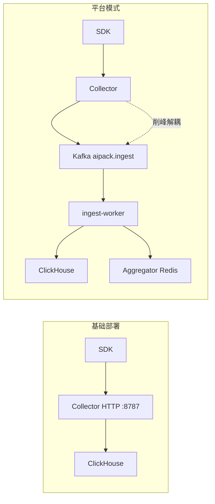
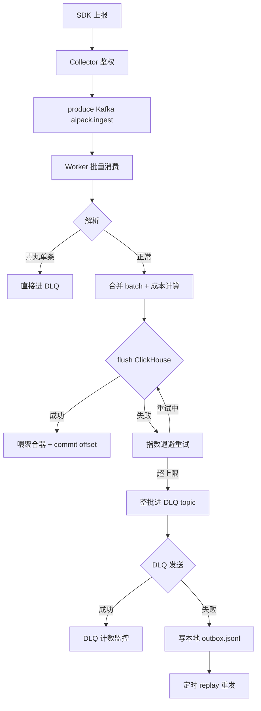

# 可观测性服务设计深度解析:从埋点上报到全链路追踪

> LLM 应用一旦进入 Agent 形态,可观测性的复杂度会陡然上升:一次 run 可能横跨多次模型调用、几十个工具调用、若干次重试,还涉及 token 成本、权限拦截、版本回归。把日志打到 stdout、用 Prometheus 抓几个 counter,根本追不到「这一步为什么慢」「这次为什么贵」。本文以 [aipack](https://github.com/luoguoxiong/aipack) 的 `packages/observability-server` 实现为蓝本,系统拆解一个面向 LLM/Agent 的可观测性收集服务是怎么设计的:双模式架构、列式存储、消息队列削峰、两级聚合、成本告警、多租户 RBAC。

## 一、为什么需要专门的可观测性服务

通用 APM(Prometheus / Jaeger / ELK)解决的是「请求 / 日志 / 指标」三件套,但 LLM 应用有几个独特诉求它们覆盖不到:

- **Trace 不是 RPC**。一次 Agent run 是一棵树:根是 run,中间是 model span / tool span,叶子是 tool_call。它的耗时不是「请求 RT」,而是「多轮 ReAct 循环累计」,需要 Gantt 式时间线还原。
- **Token 与成本是一等公民**。每次模型调用要记 input/output/cacheRead/cacheWrite 四类 token,并按模型实时单价折算成「分」。这既不是 metric 也不是 log,需要单独建模。
- **重试与退避要可追**。LLM 调用经常 429 / 502,SDK 内部会退避重试,失败原因、退避时长、HTTP 状态码分布都需要落库分析,而不是简单记一个 error count。
- **多租户隔离**。一个收集服务要接多个应用、多个项目、多个用户,数据按 appId 隔离,面板按 RBAC 可见性过滤。
- **高基数维度**。model / tool / version / errorClass / sessionKey 都是高基数维度,直方图预聚合不可行,只能现场分位数计算。
- **写入峰值与查询 SLA 解耦**。SDK 是批量突发上报(每个 run 收尾时一次性 push 几十条 span),写峰值高;但面板查询要求 p95 延迟低。两者必须拆开。

所以 aipack 没有把可观测性塞进 Runtime,而是抽出一个独立的 `observability-server`,承担 **落盘 + 聚合 + 查询 + 面板** 四件事。整个服务大约 5000 行 TypeScript,核心设计可以归纳为五块:

```
┌──────────────────────────────────────────────────────────────┐
│                    observability-server                       │
│                                                               │
│  ┌──────────┐   ┌──────────┐   ┌──────────┐   ┌──────────┐  │
│  │ Collector│   │   MQ     │   │  Worker  │   │  Store   │  │
│  │ HTTP入口 │──►│ Kafka削峰│──►│ 批量落盘 │──►│ClickHouse│  │
│  │ 鉴权限流 │   │          │   │ DLQ兜底  │   │  + MySQL │  │
│  └──────────┘   └──────────┘   └──────────┘   └──────────┘  │
│        │                                          │           │
│        │            ┌──────────┐                   │           │
│        └───────────►│Aggregator│◄─────────────────┘           │
│                     │ L1内存   │   (实时摘要 / 分位数 / 成本) │
│                     │ L2 Redis │                               │
│                     └──────────┘                               │
│                          │                                    │
│                          ▼                                    │
│                  ┌─────────────────┐                          │
│                  │ REST API + 面板 │  (查询 / 告警 / RBAC)    │
│                  └─────────────────┘                          │
└──────────────────────────────────────────────────────────────┘
```

下面按这五块逐层拆解。

## 二、双模式架构:从本地开发到生产横向扩展

设计一个收集服务最难的并不是写代码,而是「同一份代码要同时满足两种截然不同的部署形态」。aipack 用一份配置开关 `MQ_ENABLED` 在两种模式间切换,避免维护两套代码:

| | 基础部署 | 平台模式(生产) |
|---|---|---|
| 落盘 | collector 直写 ClickHouse | Kafka 解耦 → worker 批量写 |
| 聚合 | 进程内 memory | Redis / hybrid(L1+L2,多实例共享) |
| 业务库 | MySQL | MySQL(同左) |
| 依赖 | Docker 起 MySQL + ClickHouse | + Kafka + Redis |
| 适用 | 本地开发、单实例 | 生产、横向扩展 |



切换发生在 `src/config.ts` 里:`MQ_ENABLED=true` 时 collector 不再直写 ClickHouse,而是把 `EventBatch` 序列化后 produce 到 Kafka topic `aipack.ingest`;落盘职责完全交给独立的 `ingest-worker` 进程消费。这个解耦带来三个好处:

1. **写峰值与存储解耦**:SDK 突发上报几万条 span,collector 只是 produce 几条 Kafka 消息(亚毫秒级),不会被 ClickHouse 慢插入拖垮 HTTP 入口。
2. **横向扩展**:worker 多实例共用 `KAFKA_GROUP_ID`,Kafka 自动 rebalance 分配 partition(topic 默认 6 分区 = 并发上限)。
3. **故障隔离**:ClickHouse 短暂不可用时,Kafka 作为缓冲继续接消息,worker 重试落盘,SDK 完全无感。

注意这个切换有一个硬性约束——`src/worker/ingest-worker.ts` 启动时会检查 `cfg.mq.enabled`,如果为 false 直接抛错退出:

```ts
if (!cfg.mq.enabled) {
  throw new Error('MQ_ENABLED=false，worker 无需启动');
}
```

这是一个反直觉但很重要的设计:不启用 MQ 时,collector 自己直写 ClickHouse,worker 起来没有任何消息可消费,白白占用进程。**让进程快速失败(fail-fast)而不是默默空转**,是后端服务的常识。

## 三、数据模型:Trace 是一棵树

整个可观测性服务的核心数据模型只有六个记录类型,全部定义在 SDK 包 `@aipack-ai/observability` 里,server 端只负责落盘和聚合:

- `RunRecord`:一次 run/stream 的根,包含 traceId / appId / model / version / status / turns / duration / tokens / costCents
- `SpanRecord`:run / model / tool 三种 kind 的时间线节点,model span 额外含 attempts / tokens / sessionKey / costCents
- `ToolCallRecord`:工具调用明细,状态有 ok / error / blocked / skipped 四种
- `EventRecord`:自定义业务事件,任意 JSON
- `RetryRecord`:模型调用重试明细,含 HTTP 状态码、退避时长
- `PermissionRecord`:权限拦截记录,只计入聚合计数,不落库

它们被打包成 `EventBatch` 一次性上报——这是降低 SDK → server 网络往返的关键。一个 Agent run 收尾时,SDK 把这次产生的所有 span / tool_call / retry / event 凑成一个 batch,一次 HTTP POST 上去。

```ts
interface EventBatch {
  runs: RunRecord[];
  spans: SpanRecord[];
  toolCalls: ToolCallRecord[];
  permissions: PermissionRecord[];
  retries: RetryRecord[];
  events: EventRecord[];
}
```

collector 收到后的处理链路(`src/collector.ts` 的 ingest handler):

1. 读 `x-app-id` / `x-app-secret` 头,调 `appStore.verifyApp` 鉴权
2. 解析并校验 `EventBatch`
3. 按 runs / spans / toolCalls / permissions / retries / events 归一化
4. **MQ 模式**:produce 到 Kafka;**直连模式**:`traceStore.flush(batch, appId)` 同步落盘
5. 喂聚合器(更新内存 / Redis 实时指标)
6. 更新 app 访问时间

注意第 4 步在两种模式下行为完全不同,但第 5 步「喂聚合器」的职责位置也跟着变了——**MQ 模式下 collector 不再喂聚合器**,因为消息可能还要在 Kafka 里排队几秒才被 worker 消费,这时 collector 喂的指标会和最终落盘的数据错位。聚合职责统一搬到 worker 里:worker `flush` 成功后才喂聚合器,保证「聚合器看到的指标 = 已落盘的数据」。这个细节是双模式最容易踩坑的地方。

## 四、列式存储:ClickHouse + MySQL 双库分工

### 4.1 为什么是 ClickHouse 而不是 PostgreSQL

LLM 可观测性的查询模式高度适合列式存储:

- **写多读少,批量写**:SDK 一次推几十条 span,worker 攒批 500 条一次 flush
- **按时间范围扫描**:面板查询都是 `WHERE started_at BETWEEN ? AND ?`,按日期分区天然友好
- **高基数聚合**:`GROUP BY model, tool, version, error_class` 这种聚合在行存里要做大量随机 IO,列存只读相关列
- **分位数计算**:`quantile(0.95)(duration_ms)` 在 CH 里是原生函数,行存要在应用层排序

所以明细数据(runs / spans / tool_calls / events / retry_attempts)全部落 ClickHouse,业务数据(应用 / 用户 / 项目 / Agent 定义 / 价格库 / ACL / 告警规则)落 MySQL。两库通过 `app_id` 弱关联,互不依赖。

### 4.2 表结构设计:三个关键技巧

看 `infra/clickhouse/init.sql` 的 `runs` 表:

```sql
CREATE TABLE IF NOT EXISTS runs (
  trace_id      String,
  app_id        LowCardinality(String),
  started_at    DateTime64(3, 'UTC'),
  ended_at      DateTime64(3, 'UTC'),
  session_key   LowCardinality(String),
  channel       LowCardinality(String),
  model         LowCardinality(String),
  version       LowCardinality(String),
  status        Enum('success' = 1, 'error' = 2, 'validation' = 3),
  error_class   LowCardinality(String),
  turns         UInt16,
  duration_ms   UInt32,
  input_tokens  UInt32,
  output_tokens UInt32,
  cache_read    UInt32,
  cache_write   UInt32,
  cost_cents    UInt32
) ENGINE = MergeTree
PARTITION BY toYYYYMMDD(started_at)
ORDER BY (app_id, started_at, trace_id)
TTL toDateTime(started_at) + INTERVAL 90 DAY
SETTINGS index_granularity = 8192;
```

三个技巧值得拿出来说:

**技巧一:`LowCardinality(String)` 包裹高重复列**。`app_id` / `model` / `version` / `status` 这种列虽然类型是 String,但基数极低(可能就几十个值)。CH 会把它们内部编码成字典索引,存储压缩到原来 1/10,扫描时也走字典比较,比裸 String 快几个数量级。

**技巧二:`ORDER BY` 即索引**。CH 没有传统 B+ 树索引,`ORDER BY (app_id, started_at, trace_id)` 决定了数据在磁盘上的物理排序。面板查询 99% 是「某 app 在某时间段的 runs」,这个排序让查询只需扫描连续的磁盘块,配合稀疏索引(`index_granularity = 8192`)定位 partition。

**技巧三:`PARTITION BY toYYYYMMDD` + `TTL 90 DAY`**。按天分区让 `ALTER TABLE ... DELETE WHERE started_at < ?` 这种 TTL 清理变成「直接 drop 整个 partition 文件」,而不是逐行删除。配合下面的冷归档,完整生命周期是:

```
0~90 天  → runs 表(MergeTree,本地 SSD,热查询)
90 天+   → trace_archive 表(S3 引擎,Parquet 格式,冷归档)
```

`trace_archive` 用 `ENGINE = S3('https://s3.amazonaws.com/aipack-archive/', 'Parquet')` 直接映射到 S3 上的 Parquet 文件。查询时根据 `since` 是否超过 90 天在两表间路由:

```ts
// src/stores/clickhouse-store.ts
const ARCHIVE_THRESHOLD_MS = 90 * 24 * 60 * 60 * 1000;
// since 超过 90 天 → 查 trace_archive;否则查 runs
```

这是个典型的「热冷分层」:热数据 SSD 上要快,冷数据归档到对象存储要便宜。归档动作由独立的 `archive/scheduler.ts` 定时把过期的 runs 导出成 Parquet 写到 S3,然后让 CH 的 TTL 自动清理本地表。

### 4.3 TraceStore 接口:存储后端可替换

为了让 collector 不绑死 ClickHouse,server 在 `src/store.ts` 抽象了 `TraceStore` 接口:

```ts
interface TraceStore {
  insertRun(r: RunRecord): Promise<void>;
  insertSpan(s: SpanRecord): Promise<void>;
  insertToolCall(t: ToolCallRecord): Promise<void>;
  flush(batch: EventBatch, appId: string): Promise<void>;
  queryRuns(filter: RunQueryFilter): Promise<RunListItem[]>;
  queryTrace(traceId: string): Promise<TraceDetail>;
  prune(before: number): Promise<void>;
  backup(): Promise<void>;
  healthCheck(): Promise<void>;
  close(): Promise<void>;
}
```

历史上这个接口还实现过 SQLite 后端(本地开发用),后来因为高基数聚合性能太差被移除,只保留 ClickHouse。但接口保留下来,意味着未来要支持其他列存(比如 Doris / Druid)改动只在一个文件内。**接口抽象的真正价值不是「立刻换实现」,而是「限制了变更的爆炸半径」**。

`flush` 是接口里最重要的方法——它接受整个 `EventBatch` 一次性批量写,而不是逐条 insert。ClickHouseStore 的实现把 batch 拆成 runs / spans / tool_calls / events / retry_attempts 五个数组,`Promise.all` 并行调 `client.insert(...)`:

```ts
async flush(batch: EventBatch, appId: string): Promise<void> {
  await Promise.all([
    this.client.insert('runs', batch.runs.map(r => runToRow(r, appId))),
    this.client.insert('spans', batch.spans.map(s => spanToRow(s, appId))),
    this.client.insert('tool_calls', batch.toolCalls.map(t => toolToRow(t, appId))),
    this.client.insert('events', batch.events.map(e => eventToRow(e, appId))),
    this.client.insert('retry_attempts', batch.retries.map(r => retryToRow(r, appId))),
  ]);
}
```

底层 `ClickHouseClient.insert` 把行数组 JSON 拼接成 `FORMAT JSONEachRow` 单次 HTTP POST,这是 CH 推荐的批量写入姿势——一次 HTTP 请求写 N 行,而不是 N 次 HTTP 请求各写一行。

### 4.4 物化视图:预聚合优化 Dashboard

光有原始表还不够,面板的「按应用 + 模型聚合」查询如果每次都扫 runs 表会慢。init.sql 里建了一个物化视图:

```sql
CREATE MATERIALIZED VIEW IF NOT EXISTS mv_runs_by_app_model
ENGINE = SummingMergeTree
PARTITION BY toYYYYMMDD(day)
ORDER BY (app_id, model, day)
TTL day + INTERVAL 365 DAY
AS
SELECT
  app_id, model, toDate(started_at) AS day,
  count() AS requests,
  sum(if(status = 'success' AND error_class = '', 1, 0)) AS success,
  sum(input_tokens + output_tokens + cache_read + cache_write) AS tokens,
  sum(cost_cents) AS cost_cents
FROM runs
GROUP BY app_id, model, day;
```

`SummingMergeTree` 引擎会在后台合并相同 (app_id, model, day) 的行,把数值列加起来。最终这张物化视图里每天每个 (app, model) 只有一行,dashboard 查「近 30 天某 app 各模型的请求数和成本」只需扫几百行而不是几千万行原始 runs。TTL 设 365 天,比热表长,因为聚合数据体积小、价值高。

## 五、削峰解耦:Kafka + Worker + DLQ 三级容错

平台模式下,从 SDK 到 ClickHouse 之间隔着 Kafka 和 worker,任何一环都可能失败。aipack 设计了一条「**重试 → DLQ topic → 本地 outbox**」的三级容错链:



### 5.1 Worker 批量消费:攒批 + 手动 offset

worker 不是「消费一条处理一条」,而是用 kafkajs 的 `eachBatch` API 攒批消费,关键参数:

- `maxBatchSize = 500`:单批最大消息数
- `maxBatchMs = 1000`:攒批超时,即使没攒够 500 条也按 1s 超时触发
- `fromBeginning = false`:默认只消费新消息

**手动提交 offset 是这里的命门**——必须等 `traceStore.flush` 成功后才 `resolveOffset` + `commitOffsetsIfNecessary`。如果用自动提交,flush 失败的消息已经被标记为消费完成,数据就蒸发了。手动提交保证了「至少一次」语义:flush 失败 → 不提交 offset → Kafka 重投递 → 下一轮重试。代价是可能重复消费,所以 ClickHouse 写入要幂等(通过 trace_id + span_id 去重,CH 的 `ReplacingMergeTree` 也能处理重复)。

### 5.2 重试:指数退避的上限选择

`flush` 失败时,worker 整批重试,退避公式:

```ts
const delay = Math.min(500 * Math.pow(2, attempt - 1), 10_000);
await new Promise((r) => setTimeout(r, delay));
```

500ms → 1s → 2s → 4s → 8s,上限 10s。这个上限是踩过坑才调出来的——注释里写得很直白:

> D13 修复:指数退避 500ms 起步、上限 10s(此前 100/200/400ms 上限过低,CH 短暂不可用即推 DLQ)

上限过低意味着 CH 短暂抖动(比如一次 compaction 几秒)就会把消息推到 DLQ,然后人要去捞 DLQ 重放。上限 10s 能覆盖绝大多数短暂故障,只有真正的持久故障才会进 DLQ。这种「把容错参数写进注释」的习惯,后端代码里特别值得保留。

### 5.3 DLQ:topic + 本地 outbox 双保险

重试达上限(`KAFKA_MAX_RETRIES` 默认 3)后,整批消息进 DLQ topic `aipack.ingest.dlq`。但 DLQ topic 本身也是 Kafka,也可能不可用。所以 aipack 在 `src/worker/dlq.ts` 里加了一层本地 outbox 兜底:

```ts
// DLQ 发送失败时,写本地 pending.jsonl
async function sendToDlq(producer, msg) {
  try {
    await producer.sendToDlq(msg);
  } catch (e) {
    await dlqOutbox.append(msg);  // 写本地 JSONL 文件
  }
}
```

`pending.jsonl` 是 append-only 的本地文件,worker 启动时和运行中定期调 `outbox.replay()` 把积压的消息重发到 DLQ topic,成功一条删一条。这一层保证了「**DLQ 永远不丢消息**」——即使整个 Kafka 集群挂了,消息也只是躺在本地文件里,等 Kafka 恢复了再重放。

更细的一点:DLQ 速率本身也要监控。`dlqMonitor` 每 60s 统计一次 DLQ 写入次数,超过 10 条就打告警日志。这是「**容错机制本身也需要被监控**」的体现——DLQ 堆积说明上游正在系统性故障,不能等用户投诉才发现。

### 5.4 毒丸消息:单条失败不连累整批

`EventBatch` 是数组,某条消息 JSON 格式错或字段缺失是「毒丸」。如果因为一条毒丸让整批 flush 失败,整批重试又因为同一条毒丸再次失败,这就是经典的「毒丸卡死队列」。

worker 的处理是:解析阶段就把毒丸筛出来直接进 DLQ,不让它进入 `flush` 流程。`valid` 数组只包含能正常解析的消息,毒丸单条进 DLQ 不影响其他消息的批量落盘。这个分层很重要——**解析错和落盘错是两种完全不同的错误,不能混在一个重试循环里**。

## 六、实时聚合:L1 内存 + L2 Redis

ClickHouse 适合批量查询,但面板的「最近 1 小时成功率」「实时 p95」这种查询如果每次都打 CH,既慢又贵。aipack 抽象了 `Aggregator` 接口,把实时指标维护在内存里:

```ts
interface Aggregator {
  ingestRun(r: RunRecord): void;
  ingestModelCall(s: SpanRecord): void;
  ingestToolCall(t: ToolCallRecord): void;
  ingestPermission(p: PermissionRecord): void;
  ingestRetry(r: RetryRecord): void;
  summary(filter: SummaryFilter, groupBy?: GroupBy): AggregatedMetrics;
  timeseries(filter: SummaryFilter, metric: TimeseriesMetric): TimeseriesPoint[];
  tools(filter: SummaryFilter): ToolStat[];
}
```

三种实现通过 `AGGREGATOR` 环境变量切换:

- `memory`:进程内滑动窗口(默认窗口 60min,桶粒度 1min)。单实例够用,重启即丢。
- `redis`:所有指标写 Redis,多实例共享。适合多 worker 部署。
- `hybrid`:L1 内存 + L2 Redis,推荐生产用。

### 6.1 hybrid 模式:L1/L2 协同去重

`hybrid` 是最精妙的设计。写入路径是「**双写**」:

```ts
// src/aggregator/hybrid-aggregator.ts
async ingestRun(r: RunRecord): Promise<void> {
  this.l1.ingestRun(r);                    // 同步写 L1
  this.l2.ingestRun(r).catch(e =>            // 异步 fire-and-forget 写 L2
    console.warn('[hybrid] L2 ingest 失败:', e.message)
  );
}
```

L1 是同步的,保证本地查询毫秒级返回;L2 是异步 fire-and-forget,失败只 warn 不阻塞主路径。这是「**最终一致 + 性能优先**」的取舍。

读取路径是「**并行查 + 去重合并**」:

```ts
async summary(filter, groupBy?) {
  const [l1Metrics, l2Metrics] = await Promise.all([
    this.l1.summary(filter, groupBy),
    this.l2.summary(this.subtractL1Window(filter), groupBy),
  ]);
  return mergeMetrics(l1Metrics, l2Metrics);
}
```

关键是 `subtractL1Window`——L2 查询时按 L1 边界时间排除 L1 已覆盖的区间,**避免 L1/L2 数据双计**。比如 L1 保留最近 5 分钟,那查「最近 1 小时」时 L2 只返回 5 分钟之前的数据,L1 返回 5 分钟之内的数据,合并后就是完整的 1 小时,没有重复。

这个设计让「**单实例快速查询**」和「**多实例数据共享**」兼得:L1 命中本地毫秒返回,长窗口或跨实例查询回落到 L2。如果 L2 Redis 挂了,L1 仍能独立服务最近窗口的查询,服务降级但不中断。

### 6.2 分位数:不排序的近似算法

`AggregatedMetrics` 里要算 p50 / p95 / p99,传统做法是收集所有 duration 样本排序后取分位。但 LLM 调用一天可能几百万次,排序不可行。aipack 用了固定桶直方图(`src/histogram.ts`):

```ts
// 按累积计数定位分位
function percentile(buckets: Bucket[], q: number): number {
  const total = sum(buckets.map(b => b.count));
  const target = total * q;
  let acc = 0;
  for (const b of buckets) {
    acc += b.count;
    if (acc >= target) return b.upperBound;  // 返回所在桶上界
}
```

桶是预定义的(比如 0-10ms / 10-50ms / 50-100ms / ... / 30s+),`ingest` 时只增加对应桶的计数,不存原始样本。查询时按累积计数定位分位所在的桶,返回桶上界。

代价是精度——返回的是桶上界不是真实样本值。但生产监控不需要数学精确,p95 误差 5% 完全可接受,换来的好处是:**内存占用恒定(几十个桶)、写入 O(1)、查询 O(桶数)**,可以无限累积样本不爆内存。这是典型的「**用精度换可扩展性**」的工程取舍,跟 Prometheus 的 `histogram_quantile` 是同一个思路。

## 七、成本计算:Token → 分

LLM 应用的可观测性必须有成本维度。aipack 的成本计算在 `src/cost/calculator.ts`,核心公式:

```ts
function computeCents(span: CostSpanInput, price: ModelPrice): number {
  const dollars =
    (input / 1e6) * price.inputPer1m +
    (output / 1e6) * price.outputPer1m +
    (cacheRead / 1e6) * price.cacheReadPer1m +
    (cacheWrite / 1e6) * price.cacheWritePer1m;
  return Math.round(dollars * 100);  // 美元 → 分
}
```

几个设计点值得注意:

**单位是「分」不是「美元」**。LLM 单次调用成本可能不到 0.001 美元,用浮点美元累加会丢精度。「分」是整数,`UInt32` 列存,累加精确无误差。面板展示时再除以 100 转美元。这是财务计算的常识——**永远用最小货币单位的整数,不要用浮点**。

**四类 token 分别计价**。input / output / cacheRead / cacheWrite 单价不同,Anthropic 的 prompt caching 就是 cacheRead 远低于 input,需要分开算。`cacheWrite` 单独计价是因为写缓存有额外成本。

**价格内存缓存 5 分钟**。模型价格表存 MySQL,但每个 span 都查 DB 会把 MySQL 打爆。`CostCalculator` 内部维护一个 `Map<modelId, PriceCacheEntry>`,TTL 5 分钟,worker 批量处理前调 `preloadPrices(modelIds)` 一次性预热:

```ts
async preloadPrices(modelIds: string[]): Promise<void> {
  const unique = [...new Set(modelIds)];
  await Promise.all(unique.map(id => getPrice(id)));  // 并发查 DB 填充缓存
}

calculate(span: CostSpanInput): number {
  if (!span.modelId) return 0;
  const price = getCachedPrice(span.modelId);  // 同步读缓存
  if (!price) return 0;                         // 找不到价格返回 0,不阻塞
  return computeCents(span, price);
}
```

注意 `calculate` 是同步的——这是为了对齐 worker 的批量循环接口,避免循环里逐个 `await`。代价是「找不到价格时返回 0」而不是抛错。这是个有意的取舍:**成本计算失败不能阻塞 ingest 主路径**,宁可这条 span 的成本记为 0,事后从面板补价格再重算,也不能让一条 span 的价格查询失败拖垮整个 batch 的落盘。

## 八、告警引擎:规则 + 状态机

光有指标没有告警等于没有可观测性。aipack 的告警在 `src/alerts/`,设计成规则驱动的状态机:

### 8.1 规则定义

```ts
// src/alerts/rules.ts
type Metric = 'successRate' | 'p95Ms' | 'toolSuccessRate' | 'versionSuccessRate' | ...;
type Operator = 'lt' | 'lte' | 'gt' | 'gte' | 'regress_by';
```

最有意思的是 `regress_by`——专门给「版本回归」用的。Agent 发布新版本后,如果新版本的成功率比上一版低 5%,自动触发告警。这比简单的 `lt 0.9` 阈值更贴合 LLM 应用的实际诉求:**绝对阈值往往不适用,相对回归才是关键**。

### 8.2 评估循环

`src/alerts/evaluator.ts` 是告警引擎主循环:

```ts
// 拉取规则 → 计算指标 → compare 判断 → 状态转换
for (const rule of rules) {
  const metrics = await aggregator.summary({ ...rule.filter });
  const value = extractMetric(metrics, rule.metric);  // successRate/p95Ms/...
  const violated = compare(value, rule.operator, rule.threshold);
  
  if (violated && prevState === 'ok') {
    await transitionTo('fired', rule, value);
    await notify(rule, value, 'fired');
  } else if (!violated && prevState === 'fired') {
    await transitionTo('recovered', rule, value);
    await notify(rule, value, 'recovered');
  }
}
```

状态只有两个:`fired` 和 `recovered`(初始算 `ok`)。**避免告警风暴**的关键是只在状态转换时通知——已经 fired 的规则持续违反阈值,不会重复发通知;只有从 fired 转回 ok 才发一条 recovered。否则一个持续低成功率的应用会每分钟刷屏。

通知走 webhook(`src/alerts/notify.ts`),payload里带规则名、当前值、阈值、回归幅度。webhook URL 在创建规则时校验过——必须通过 SSRF 防护(见第九节)。

## 九、多租户 RBAC 与安全

可观测性服务天然是多租户的:多个应用、多个项目、多个用户共用一套基础设施。aipack 的安全模型围绕「项目」组织:

### 9.1 JWT + Cookie 双通道

```ts
// src/auth/jwt.ts
interface AccessTokenPayload {
  sub: string;        // userId
  email: string;
  role: 'admin' | 'user';
  pid?: string;       // 当前 projectId
  type: 'access';
  exp: number;
  iat: number;
}
```

Access token 短期(默认 15 分钟),refresh token 长期(默认 7 天),通过 HTTP-only Cookie 下发。HTTP-only 是关键——前端 JS 拿不到 token,无法被 XSS 偷走。Refresh 端点校验 refresh token 后重新签发 access token,实现「**短期 access + 长期 refresh**」的无感续期。

JWT 签名用 HS256 + `crypto.timingSafeEqual` 防时序攻击,签名比较是恒定时间的:

```ts
// 防时序攻击:用 timingSafeEqual 而不是 ===
const a = Buffer.from(sigA);
const b = Buffer.from(sigB);
if (a.length !== b.length) return false;
return crypto.timingSafeEqual(a, b);
```

密码哈希用 `crypto.scrypt`(N=32768, r=8, p=1),不是过时的 bcrypt——Node 内置,无原生依赖,抗 GPU 暴力破解。

### 9.2 项目级 RBAC

```ts
// src/stores/acl-store.ts
type ProjectRole = 'owner' | 'editor' | 'viewer';

// 角色级别:viewer=1 < editor=2 < owner=3
const ROLE_LEVEL: Record<ProjectRole, number> = {
  viewer: 1, editor: 2, owner: 3,
};

function hasRole(actual: ProjectRole, required: ProjectRole): boolean {
  return ROLE_LEVEL[actual] >= ROLE_LEVEL[required];
}
```

权限模型简单清晰:**只有三级,按级别高低比较**。`requireRole('editor')` 中间件允许 editor 和 owner 通过,挡住 viewer。没有复杂的权限位掩码,因为可观测性面板的权限需求本来就不复杂——能看、能改配置、能管理成员,这三档足够。

中间件还处理「项目切换」:用户切到另一个项目时,重新查 ACL 角色,签发新的 access token(带新 pid)。**权限不是登录时一次性确定,而是按当前上下文动态判定**,这是多项目 SaaS 的常见模式。

### 9.3 限流:进程内 + Redis 双实现

`src/rate-limit.ts` 是进程内令牌桶,`src/rate-limit-redis.ts` 是 Redis 分布式令牌桶。基础模式用前者,平台模式用后者。Redis 实现的命门是用 Lua 脚本保证原子性:

```lua
-- 原子执行:读令牌 → 补充 → 扣减 → 写回 → 设 TTL
local current = tonumber(redis.call('GET', key) or capacity)
local refill = (now - last_time) * refill_rate
current = math.min(capacity, current + refill)
if current < 1 then return 0 end
current = current - 1
redis.call('SETEX', key, ttl, current)
return 1
```

如果用「先 GET 再 SET」两步操作,多实例并发时会出现「都读到 1 个令牌、都扣减、都写回 0」的超卖。Lua 脚本在 Redis 单线程内原子执行,保证多实例下限流计数一致。这是分布式限流的经典套路。

### 9.4 SSRF 防护:URL Guard

告警 webhook URL 是用户配置的,必须防止用户配一个内网地址让服务端去访问(经典的 SSRF)。`src/security/url-guard.ts` 做了三道防线:

1. **协议白名单**:只允许 `http:` / `https:`
2. **IP 字面量校验**:URL 里直接写 IP 的,拒绝内网段(`10.0.0.0/8`、`127.0.0.0/8`、`169.254.0.0/16` 等)
3. **DNS 解析校验**:`assertPublicHttpUrl` 会真的 `dns.lookup` 一次,拒绝解析到内网地址的域名(防 DNS rebinding 攻击)

第三道最关键——光校验 URL 字符串挡不住 `evil.com` 解析到 `127.0.0.1` 的攻击。必须真的解析一次 DNS 看解析结果。这是个容易被忽略但很重要的细节。

## 十、查询 API 与 Web 面板

### 10.1 REST 查询接口

collector 同时承担 API 服务和查询服务,端口复用 `:8787`。查询接口分两类:

**应用侧查询(用 appId/appSecret 鉴权)**:

| 端点 | 说明 |
|---|---|
| `GET /metrics/summary?since&until&groupBy=model\|tool\|session` | 聚合摘要(requests/successRate/totalTokens/p50/p95/p99/retryRate) |
| `GET /metrics/timeseries?since&until&step&metric` | 时间序列 |
| `GET /metrics/tools?since&until` | 工具成功率排行 |
| `GET /metrics/versions?since&until` | 版本对比 |
| `GET /metrics/cost?since&until` | 成本统计 |
| `GET /metrics/error-classes?since&until` | 错误归类 |
| `GET /traces?since&until&status&model&tool&page` | 运行列表 |
| `GET /traces/:traceId` | Trace 明细(spans 时间线) |

**面板管理接口(JWT 鉴权)**:`/api/auth/*`、`/api/apps`、`/api/projects`、`/api/users/*`、`/api/alerts/*`。

### 10.2 前端面板

面板用 React + Vite 构建,产物在 `web/dist`,构建时打包进 server 的 `dist/main.js`,运行时 `GET /` 直接返回面板 HTML,无需另起前端服务。这是一个对自托管部署很友好的设计——**一个二进制 = API + 面板 + 静态资源**,部署只要一个进程。

页面包括:

- `DashboardPage`:KPI 卡片 + 趋势图(EChart)
- `TracesPage`:运行列表 + 过滤
- `TraceGantt`:单 Trace 的 spans 甘特图
- `ErrorClassDrillPage`:错误分类下钻
- `AgentDefsPage`:Agent 定义管理
- `AlertsPage`:告警规则与历史
- `AppsPage` / `ProjectsPage` / `ProjectMembersPage`:多租户管理
- `ModelPricesPage`:模型价格库维护

`TraceGantt` 是面板最有价值的可视化——把一次 run 的所有 span 按时间画成甘特条,哪个 model span 慢、哪个 tool call 卡住,一眼就能看出。这是 LLM 可观测性区别于通用 APM 的核心场景。

## 十一、设计权衡与反思

回过头看整个 observability-server 的设计,有几个值得反思的取舍:

**1. 双模式 vs 单一平台模式**。维护两套代码路径是有成本的——collector 的 ingest handler 要根据 `MQ_ENABLED` 分支,聚合器要根据 `AGGREGATOR` 分支,worker 有 fail-fast 检查。但这种成本换来的是「本地开发零依赖 Kafka/Redis」的体验,对开源项目的早期采用率至关重要。等到用户量上来,可以慢慢收口到单一平台模式。

**2. ClickHouse vs PostgreSQL**。ClickHouse 的运维成本不低(需要单独的集群、备份策略、冷归档调度),对小型团队是负担。如果数据量不大(< 1 亿条 runs),PostgreSQL + TimescaleDB 也能扛,而且省一个组件。但 aipack 选 CH 的理由是面向未来——LLM 应用的 trace 增长速度远超传统应用,一天几百万条 span 很快就到亿级,这时 CH 的列存优势才真正发挥。

**3. DLQ 三级容错是否过度设计**。本地 outbox 兜底 DLQ 这一层,在 99% 的部署里都不会触发。但那 1% 的「整个 Kafka 集群挂了」场景,如果没有这层,数据就真的丢了。可观测性服务丢数据是恶性循环——丢的恰好是故障期间的数据,事后排查时最需要的就是这段时间的 trace。所以这一层是「**为最坏情况买保险**」,代价只是一个 JSONL 文件,值得。

**4. 聚合器 hybrid 模式的复杂度**。L1/L2 双写 + 去重合并的逻辑比单一 Redis 实现复杂得多。但复杂度换来了「**单实例毫秒级查询 + 多实例数据共享**」兼得。如果只做 SaaS 多租户,纯 Redis 就够;但 aipack 还要支持本地单实例部署,这时 L1 内存就能独立服务,不依赖 Redis。这是为部署灵活性付的复杂度税。

**5. 成本计算为什么不在 SDK 侧算**。理论上 SDK 知道每次调用的 token 用量,可以直接算成本上报。但 aipack 把成本计算放在 server 侧,理由是:**价格是动态的,会变**。模型今天 $3/1M,明天降价到 $2/1M,如果 SDK 算成本,历史数据就成了「按当时价格」的混合值,无法重新计算。server 侧算则只存 token 用量,成本按当前价格表实时算,价格更新后面板自动反映新成本。这是「**存原始量,派生计算值**」的数据库设计原则在成本维度的应用。

---

整个 observability-server 的设计哲学可以总结成一句话:**「为故障设计,为扩展设计,为多租户设计」**。每一层都有容错(重试 / DLQ / outbox / 降级),每一层都可以横向扩展(worker 多实例 / 聚合器多后端 / 限流多实现),每一层都按 appId / projectId 隔离。这不是一个「能跑的 Demo」,而是一个面向生产的可观测性服务该有的样子。

相关代码:[aipack/observability-server](https://github.com/luoguoxiong/aipack/tree/main/packages/observability-server)。配合阅读 [Agent Runtime 设计深度解析](ai/agent-runtime-design.md) 能看到埋点 SDK 是怎么从 Runtime 里产出 `EventBatch` 的,两端对照能更完整地理解整个可观测性闭环。
