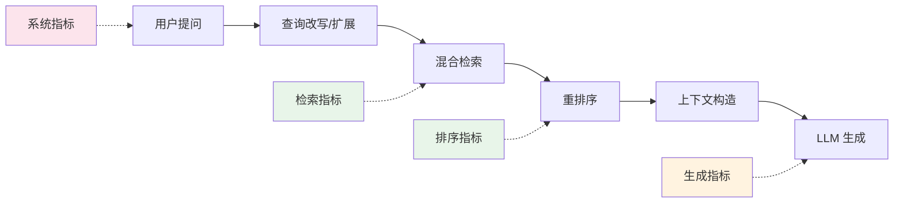
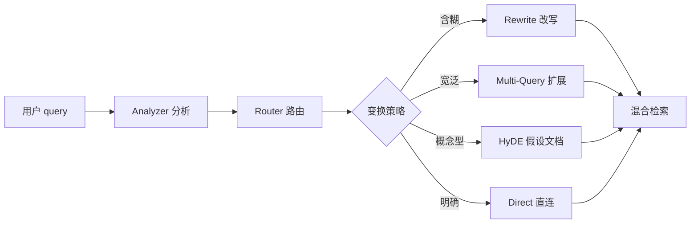
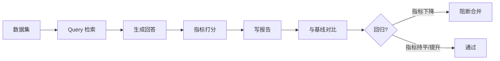
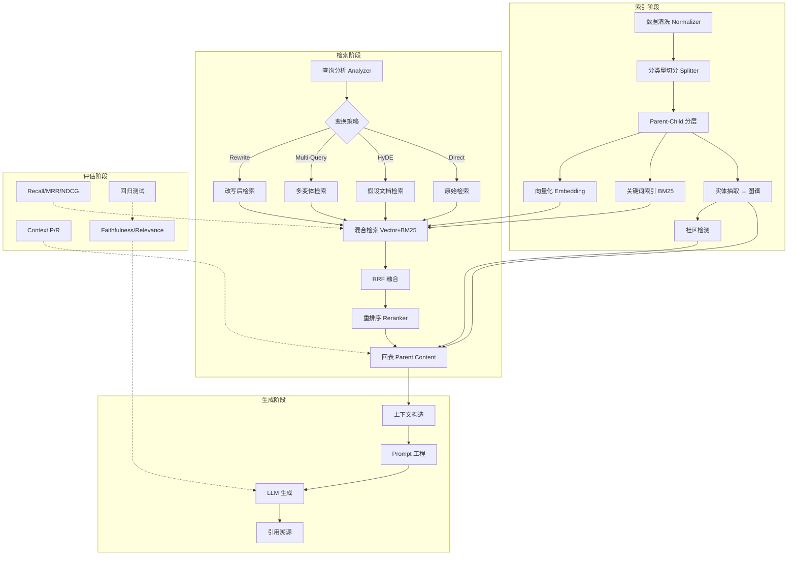

# RAG 性能指标与优化实践：从度量到提升的全链路指南

> RAG 系统上线容易，优化难。检索准不准、生成有没有幻觉、端到端延迟高不高——每一项都需要可度量的指标来驱动改进。本文系统梳理 RAG 的性能指标体系，并结合 [learn-rag](https://github.com/luoguoxiong/learn-rag) 项目的真实实现，讲解每个环节的优化策略与工程落地。

## 一、为什么需要性能指标

RAG 不是「能跑就行」的系统。同样的知识库，切分策略调一下，检索准确率可能差 30%；重排序加一下，生成质量可能提升一个档次。没有指标，优化就是盲人摸象。



RAG 的性能可以分为四个维度：

| 维度     | 关注什么                     | 核心指标                                           |
| -------- | ---------------------------- | -------------------------------------------------- |
| 检索质量 | 召回了多少相关内容           | Recall@K, Hit Rate, MRR, NDCG                      |
| 上下文质量 | 检索内容对生成是否有效     | Context Precision, Context Recall                  |
| 生成质量 | 回答是否准确、忠实、相关     | Faithfulness, Answer Relevance                     |
| 系统性能 | 延迟、吞吐、成本             | P50/P99 延迟, QPS, Token 成本                      |

下面逐维度拆解。

## 二、检索质量指标

检索是 RAG 的地基。检索不到相关内容，再强的 LLM 也只能编造。

### 2.1 Recall@K（召回率）

**定义**：在返回的 Top-K 结果中，包含了多少比例的相关文档。

```
Recall@K = |相关文档 ∩ Top-K 结果| / |相关文档总数|
```

**直觉**：如果知识库里有 5 篇相关文档，你的系统返回了 Top-10，其中命中了 4 篇，那 Recall@10 = 4/5 = 0.8。

**为什么重要**：Recall 是上限。检索阶段漏掉的文档，生成阶段永远无法补回来。所以**优化 RAG 的第一步，永远是提高 Recall**。

### 2.2 Hit Rate（命中率）

**定义**：Top-K 结果中至少命中一个相关文档的查询比例。

```
Hit Rate = 至少命中一个相关文档的查询数 / 总查询数
```

**与 Recall 的区别**：Recall 看命中的比例，Hit Rate 看有没有命中。Hit Rate 更粗粒度，适合做快速健康检查。

### 2.3 MRR（Mean Reciprocal Rank，平均倒数排名）

**定义**：第一个相关文档排在第几位。排得越靠前，分数越高。

```
RR(q) = 1 / rank_of_first_relevant_doc
MRR = mean(RR(q) for all queries)
```

**直觉**：相关文档排第 1 位得 1.0，排第 2 位得 0.5，排第 3 位得 0.33。MRR 衡量的是「系统能不能把最相关的结果排在最前面」。

### 2.4 NDCG（Normalized Discounted Cumulative Gain）

**定义**：考虑相关性的多级程度和排名位置的指标。

```
DCG@K = Σ (rel_i / log2(i + 1))    i = 1..K
NDCG@K = DCG@K / IDCG@K
```

**直觉**：相关度高的文档排越靠前，NDCG 越高。与 MRR 只看第一个相关结果不同，NDCG 考虑所有 Top-K 结果的排序质量。

> 在 learn-rag 中，这四个指标在 [evaluation/metrics.ts](https://github.com/luoguoxiong/learn-rag/blob/main/src/evaluation/metrics.ts) 中实现，全部为纯函数，归一化到 [0,1] 区间，便于跨数据集对比。

### 2.5 learn-rag 的检索优化实践

learn-rag 在检索环节做了多层优化：

#### 混合检索 + RRF 融合

单一检索方式各有盲区。向量检索擅长语义匹配但精确关键词弱，BM25 精确匹配强但不理解语义。learn-rag 的 [retriever.ts](https://github.com/luoguoxiong/learn-rag/blob/main/src/retrieval/retriever.ts) 实现了双路并行检索：

```
                ┌─ 向量路 (Qdrant) ──┐
用户 query ────►│                     ├─ RRF 融合 ──► Top-K 结果
                └─ 关键词路 (OpenSearch) ┘
```

两路结果通过 [RRF（Reciprocal Rank Fusion）](https://github.com/luoguoxiong/learn-rag/blob/main/src/ranking/rrf.ts) 融合，公式为：

```
score(d) = Σ 1 / (k + rank_source(d))    # k=60
```

RRF 只依赖各来源的相对排名，不与原始分数量纲耦合，天然适合异构来源融合。

#### Parent-Child 检索

检索用小块（精准命中），生成用大块（上下文完整）。learn-rag 的 [parent-child.ts](https://github.com/luoguoxiong/learn-rag/blob/main/src/ingestion/parent-child.ts) 在索引阶段就把文档切成两层：

- **child chunk**（~400 字符）：参与向量/关键词索引，检索精准
- **parent chunk**（~2000 字符）：不参与索引，检索命中 child 后回表取其 parent 作为 LLM 上下文

```
文档
 │
 ├── parent-1 [大块，上下文完整]
 │     ├── child-1a [小块，可检索] ── 向量/关键词索引
 │     └── child-1b [小块，可检索] ── 向量/关键词索引
 │
 └── parent-2
       ├── child-2a [小块，可检索] ── 向量/关键词索引
       └── child-2b [小块，可检索] ── 向量/关键词索引

检索命中 child-1b -> 回表取 parent-1 -> 完整上下文喂给 LLM
```

#### 查询智能（Query Intelligence）

用户提问往往口语化、模糊、缺上下文。直接用原始 query 检索效果差。learn-rag 的 [query/](https://github.com/luoguoxiong/learn-rag/blob/main/src/query/index.ts) 模块实现了完整的查询优化链路：



核心优化点：

| 技术         | 原理                                           | learn-rag 实现要点                          |
| ------------ | ---------------------------------------------- | ------------------------------------------- |
| Query Rewrite | 把含糊 query 改写为清晰、自包含的检索 query   | 温度 0 保证确定性，有身份回退兜底            |
| Multi-Query   | 把宽泛 query 扩展为多个角度变体，分别检索后合并 | 温度 0.7 鼓励多样性，RRF 融合去重            |
| HyDE          | 让 LLM 先生成假设答案，用假答案向量去检索      | 生成 2~4 句假设段落，弥补 query 短而抽象    |
| Query Router  | 根据意图和置信度路由到最佳检索策略             | 高置信直连，低置信走 LLM 路由               |

#### 图谱检索补充

对于关系型、多跳型问题，向量检索力不从心。learn-rag 额外实现了图谱检索：

- [graph.ts](https://github.com/luoguoxiong/learn-rag/blob/main/src/retrieval/graph.ts)：实体链接 → Neo4j n-hop 遍历 → 子图实体回表证据 chunk
- [global-graph.ts](https://github.com/luoguoxiong/learn-rag/blob/main/src/retrieval/global-graph.ts)：基于社区摘要的全局检索（GraphRAG 简化版）
- [text2cypher.ts](https://github.com/luoguoxiong/learn-rag/blob/main/src/retrieval/text2cypher.ts)：自然语言转 Cypher 查询，带安全校验

## 三、上下文质量指标

检索到了文档，但这些文档对生成有没有用？上下文质量指标回答这个问题。

### 3.1 Context Precision（上下文精确率）

**定义**：检索到的 Top-K 上下文中，有多少比例是真正相关的。

**直觉**：检索返回了 10 个 chunk，其中只有 3 个真正相关，Context Precision = 0.3。这个指标也间接反映了「相关内容排得够不够靠前」——RAGAS 的实现中，相关 chunk 排越靠前，avg_precision 越高。

**优化方向**：提高 Context Precision 的核心手段是**重排序**。向量检索是粗排（双塔模型，query 和 doc 独立编码，快但不够准），重排序是精排（Cross-Encoder，query 和 doc 联合编码，准但慢）。

### 3.2 Context Recall（上下文召回率）

**定义**：回答问题所需的上下文，有多少被检索到了。

**直觉**：回答一个问题需要 5 个知识片段，系统只检索到了 3 个，Context Recall = 3/5 = 0.6。Context Recall 低，意味着 LLM 缺信息，只能编造。

**与检索 Recall 的区别**：检索 Recall 看文档层面，Context Recall 看信息需求层面。检索到了文档不代表检索到了全部关键信息。

### 3.3 learn-rag 的上下文优化

#### 重排序

learn-rag 的 [reranker.ts](https://github.com/luoguoxiong/learn-rag/blob/main/src/ranking/reranker.ts) 实现了两级重排：

1. **LexicalReranker（确定性）**：组合检索分（min-max 归一化）与 query↔content 词面重叠度，各占 50%。零 LLM 依赖，速度快。
2. **LLM Reranker**：让 LLM 对候选按相关性排序，输出编号序列（如 "3,1,2"），解析失败回退到原始顺序。

典型流程：向量+关键词混合检索取 Top-50 → RRF 融合 → 重排取 Top-5~10。

#### 上下文构造

[query.ts](https://github.com/luoguoxiong/learn-rag/blob/main/src/application/query.ts) 中的 Context Builder 把 Evidence 序列化为带 `[Evidence: ev_N]` 引用编号的提示词：

```text
你是一个严谨的问答助手。请仅基于以下证据回答问题。
证据不足时需说明，回答中用 [n] 标注引用来源。

【证据】
[Evidence: ev_1] 来源：产品手册.pdf / 第3页
  内容：密码重置流程...

[Evidence: ev_2] 来源：FAQ.md / 密码相关
  内容：如未收到重置邮件...
```

这种结构化上下文不仅约束了模型行为（抑制幻觉），还支持**引用溯源**。

## 四、生成质量指标

### 4.1 Faithfulness（忠实度）

**定义**：回答中的每句话是否都能在检索到的上下文中找到支持。

```
Faithfulness = 被上下文支持的断言数 / 总断言数
```

**直觉**：回答说「密码重置需要点击忘记密码按钮 [1]」，如果上下文 [1] 确实包含这个信息，这条断言算受支持。Faithfulness 是 RAG 最重要的生成指标——它直接衡量幻觉。

**优化方向**：
- 提高检索质量（检索到相关内容）
- Prompt 约束（「仅基于参考内容回答」「不知道就说不知道」）
- 引用溯源（要求模型标注信息来源）

### 4.2 Answer Relevance（回答相关性）

**定义**：回答是否切题地回答了用户问题。

```
Answer Relevance = 问题关键词在回答中的覆盖比例（简化版）
                 或 LLM 打分（0-5 分）
```

**与 Faithfulness 的区别**：Faithfulness 看回答是否「编造」（有没有上下文支持），Answer Relevance 看回答是否「跑题」（有没有回答问题）。一个回答可以 100% 忠实于上下文，但完全没回答用户问的问题。

### 4.3 learn-rag 的评估实现

learn-rag 的 [evaluation/](https://github.com/luoguoxiong/learn-rag/blob/main/src/evaluation/) 模块实现了完整的评估闭环：



| 模块         | 职责                                           |
| ------------ | ---------------------------------------------- |
| metrics.ts   | Recall@K, Hit Rate, MRR, NDCG, Context Precision/Recall |
| judge.ts     | Faithfulness 和 Answer Relevance 打分，LLM 优先 + 确定性回退 |
| regression.ts | 指标低于基线 ×(1-tolerance) 视为回归，阻断合并 |
| runner.ts    | 全链路编排：Query → Retrieve → Generate → 打分 → 报告 → 对比 |

**关键设计：确定性回退。** 每个评估环节都有 LLM 版本和确定性版本。无 API key 时，LexicalJudge 用词面重叠判断 Faithfulness，用问题词元覆盖率判断 Answer Relevance，保证评估链路不中断。

## 五、系统性能指标

除了效果指标，RAG 系统的工程性能同样关键。

### 5.1 延迟

| 阶段     | 典型耗时        | 优化手段                           |
| -------- | --------------- | ---------------------------------- |
| 查询分析 | 50~500ms        | Cheap-First：规则优先，LLM 兜底    |
| 向量检索 | 20~100ms        | ANN 索引（HNSW），并行检索          |
| 关键词检索 | 20~100ms      | BM25 倒排索引，并行检索             |
| 重排序   | 100~500ms       | 粗排 Top-50 → 精排 Top-10          |
| LLM 生成 | 1~5s            | 流式输出，上下文压缩                |
| **端到端** | **2~7s**      |                                    |

**P50/P99**：中位数和 99 分位延迟。P50 反映典型体验，P99 反映最差体验。

### 5.2 吞吐量

QPS（每秒查询数）受 LLM 生成速度限制最大。检索阶段可以水平扩展，但 LLM 推理是瓶颈。

### 5.3 成本

```
总成本 = Embedding 成本 + 检索成本 + LLM 生成成本
```

- **Embedding**：索引时一次性成本 + 查询时每次成本
- **检索**：向量库 + 关键词库的存储和计算成本
- **LLM 生成**：按 token 计费，上下文越长越贵

**优化核心：减少不必要的 LLM 调用。** learn-rag 的 Cheap-First 策略——高置信度走规则直连，低置信度才升级 LLM——正是为此设计。

### 5.4 learn-rag 的系统性能优化

#### Cheap-First 分层策略

learn-rag 在查询分析的多个环节都采用了「规则优先、LLM 兜底」的策略：

```
用户 query
  │
  ▼
Query Analyzer
  ├── 规则匹配（正则、长度、实体）── 高置信度 ──► 直接出结果（0ms LLM 调用）
  └── 低置信度 ──► LLM 分析（~500ms）──► 失败回退规则
```

[analyzer.ts](https://github.com/luoguoxiong/learn-rag/blob/main/src/query/analyzer.ts) 的核心逻辑：
- 6 种意图通过正则规则匹配（`INTENT_RULES`），零成本
- 复杂度基于长度与子句数判定，零成本
- 只有 `unknown` 意图 + 无实体 + 无变换信号时才升级到 LLM
- LLM 失败自动回退到规则结果

#### 超时与降级

```typescript
// retriever.ts - 检索超时 + 降级
const timeout = plan.timeoutMs ?? config.retrieverTimeoutMs; // 默认 3000ms
// 关键词路故障 -> 降级为纯向量检索
// Reranker 故障 -> 跳过重排，直接按 RRF 分数返回
```

#### Outbox 模式保证一致性

摄入流程（文档上传）和索引流程（向量化/关键词/图谱）异步解耦：

```
API 受理（快）          Worker 异步处理（慢）
    │                        │
    ├─ 落库 PG                ├─ 分块
    └─ 写 Outbox 事件          ├─ 向量化 → Qdrant
                              ├─ 关键词 → OpenSearch
                              └─ 实体抽取 → Neo4j
```

[outbox.ts](https://github.com/luoguoxiong/learn-rag/blob/main/src/application/outbox.ts) 实现了指数退避重试，[reconcile.ts](https://github.com/luoguoxiong/learn-rag/blob/main/src/application/reconcile.ts) 实现了对账循环修复不一致状态。

## 六、RAG 优化全景图

结合 learn-rag 的实践，以下是 RAG 各阶段的优化策略汇总：



### 6.1 索引优化

| 优化点           | 策略                                    | learn-rag 实现                          |
| ---------------- | --------------------------------------- | ---------------------------------------- |
| 文本归一化       | Unicode NFC + 控制字符清理 + 空白折叠   | [normalizer.ts](https://github.com/luoguoxiong/learn-rag/blob/main/src/ingestion/normalizer.ts) |
| 分类型切分       | Markdown 按标题分节，代码块/表格整体保留 | [splitters.ts](https://github.com/luoguoxiong/learn-rag/blob/main/src/ingestion/splitters.ts) |
| Parent-Child     | child 检索 + parent 上下文             | [parent-child.ts](https://github.com/luoguoxiong/learn-rag/blob/main/src/ingestion/parent-child.ts) |
| 幂等索引         | 稳定哈希 + onConflict 去重              | [ingestion.ts](https://github.com/luoguoxiong/learn-rag/blob/main/src/application/ingestion.ts) |
| 租户隔离         | collection/index-per-tenant             | [vector.ts](https://github.com/luoguoxiong/learn-rag/blob/main/src/indexing/vector.ts), [keyword.ts](https://github.com/luoguoxiong/learn-rag/blob/main/src/indexing/keyword.ts) |

### 6.2 查询优化

| 优化点           | 策略                                    | learn-rag 实现                          |
| ---------------- | --------------------------------------- | ---------------------------------------- |
| 意图分析         | 规则优先，LLM 兜底                      | [analyzer.ts](https://github.com/luoguoxiong/learn-rag/blob/main/src/query/analyzer.ts) |
| 查询改写         | 口语化 → 清晰自包含                     | [rewrite.ts](https://github.com/luoguoxiong/learn-rag/blob/main/src/query/rewrite.ts) |
| 多查询扩展       | 多角度变体 + RRF 融合                   | [multi-query.ts](https://github.com/luoguoxiong/learn-rag/blob/main/src/query/multi-query.ts) |
| HyDE            | 假设答案向量替代问题向量                 | [hyde.ts](https://github.com/luoguoxiong/learn-rag/blob/main/src/query/hyde.ts) |
| 查询路由         | 高置信直连，低置信 LLM 路由             | [router.ts](https://github.com/luoguoxiong/learn-rag/blob/main/src/query/router.ts) |

### 6.3 检索优化

| 优化点           | 策略                                    | learn-rag 实现                          |
| ---------------- | --------------------------------------- | ---------------------------------------- |
| 混合检索         | 向量 + BM25 并行                        | [retriever.ts](https://github.com/luoguoxiong/learn-rag/blob/main/src/retrieval/retriever.ts) |
| RRF 融合         | 按排名倒数加权，去量纲                  | [rrf.ts](https://github.com/luoguoxiong/learn-rag/blob/main/src/ranking/rrf.ts) |
| 重排序           | Lexical（确定性）+ LLM 两级精排         | [reranker.ts](https://github.com/luoguoxiong/learn-rag/blob/main/src/ranking/reranker.ts) |
| 图谱检索         | n-hop 遍历 + 社区摘要                   | [graph.ts](https://github.com/luoguoxiong/learn-rag/blob/main/src/retrieval/graph.ts) |
| 版本过滤         | 索引侧过滤 + 回表兜底双重校验            | [retriever.ts](https://github.com/luoguoxiong/learn-rag/blob/main/src/retrieval/retriever.ts) |

### 6.4 生成优化

| 优化点           | 策略                                    | learn-rag 实现                          |
| ---------------- | --------------------------------------- | ---------------------------------------- |
| Prompt 约束      | 「仅基于证据」「证据不足需说明」         | [query.ts](https://github.com/luoguoxiong/learn-rag/blob/main/src/application/query.ts) |
| 引用溯源         | `[Evidence: ev_N]` 编号 + 要求模型引用   | [query.ts](https://github.com/luoguoxiong/learn-rag/blob/main/src/application/query.ts) |
| 上下文管理       | Parent-Child 回表保证上下文完整          | [retriever.ts](https://github.com/luoguoxiong/learn-rag/blob/main/src/retrieval/retriever.ts) |

### 6.5 评估优化

| 优化点           | 策略                                    | learn-rag 实现                          |
| ---------------- | --------------------------------------- | ---------------------------------------- |
| 完整指标体系     | 检索 + 上下文 + 生成全覆盖              | [metrics.ts](https://github.com/luoguoxiong/learn-rag/blob/main/src/evaluation/metrics.ts) |
| 确定性评估       | LLM Judge + Lexical Judge 双路径        | [judge.ts](https://github.com/luoguoxiong/learn-rag/blob/main/src/evaluation/judge.ts) |
| 回归测试         | 低于基线 ×(1-tolerance) 阻断合并         | [regression.ts](https://github.com/luoguoxiong/learn-rag/blob/main/src/evaluation/regression.ts) |
| 自动化运行       | 全链路编排 + Markdown 报告               | [runner.ts](https://github.com/luoguoxiong/learn-rag/blob/main/src/evaluation/runner.ts) |

## 七、learn-rag 的核心设计模式

纵观 learn-rag 的优化实践，有几条贯穿始终的设计模式：

### 7.1 Cheap-First（廉价优先）

**核心思想：能用规则解决的不用 LLM，能用确定性方法解决的不用外部调用。**

```
规则匹配（0ms）── 高置信度 ──► 直接出结果
     │
  低置信度
     ▼
LLM 分析（~500ms）──► 成功出结果
     │
  失败
     ▼
回退规则结果（0ms）
```

在 analyzer、router、global-graph、extractor、resolver 等模块中都有体现。好处是：
- 高置信度查询零 LLM 成本
- 低置信度查询才花 LLM 调用费
- LLM 不可用时系统仍可运行

### 7.2 确定性回退

**核心思想：每个依赖外部 API 的环节都有零依赖的回退实现。**

| 模块         | LLM 实现                | 确定性回退                          |
| ------------ | ----------------------- | ----------------------------------- |
| Embedding    | OpenAI/Doubao API       | FNV-1a 哈希 feature-hashing          |
| LLM          | OpenAI chat/completions | 提取上下文 `[Evidence: ev_N]` 摘要   |
| Query Rewrite | LLM 改写               | 原样返回（IdentityRewriter）         |
| Multi-Query  | LLM 生成多变体          | 只保留原始 query                     |
| HyDE         | LLM 生成假设答案        | 跳过 HyDE                           |
| Reranker     | LLM 排序                | 词面重叠度排序                        |
| Judge        | LLM 逐条判定            | 词面重叠判断                          |
| Entity Extractor | LLM JSON 抽取       | 正则匹配（引号/专名/后缀）            |

这套设计保证了**无 API key 时全链路仍可端到端跑通**，极大降低了开发调试门槛。

### 7.3 多级容错

**核心思想：外部依赖故障时逐级降级，不中断主链路。**

```
混合检索
  ├── 向量路 OK + 关键词路 OK ──► RRF 融合（最佳）
  ├── 向量路 OK + 关键词路 FAIL ──► 纯向量检索（降级）
  └── 向量路 FAIL ──► 报错（无法检索）
```

在 retriever、graph-retriever、text2cypher、reconcile 等模块中都有多级降级逻辑。

### 7.4 Outbox + Reconcile（最终一致性）

**核心思想：业务事务内写事件，异步消费派生索引，对账循环修复不一致。**

```
写库 PG + 写 Outbox 事件（同一事务）
    │
    ▼
Worker 异步消费 Outbox
    ├── 向量索引
    ├── 关键词索引
    └── 图谱索引
    │
    ▼
Reconcile 对账循环
    ├── 派发积压 Outbox 事件
    ├── 修复 failed/pending 的 chunk
    ├── 恢复卡住的 Job
    └── 按需重建社区
```

关键约束：**外部 I/O 不持 DB 事务**，避免连接池耗尽。

## 八、优化路线图：从 0 到 1 提升 RAG 性能

如果你正在构建 RAG 系统，以下是推荐的优化顺序（按性价比排序）：

### Phase 1：基础建设（效果最大）

1. **数据清洗**：去噪声、统一编码、去重。脏数据是万恶之源。
2. **合理切分**：按文档类型选切分器，Markdown 按标题，通用按句子，带 overlap。
3. **Parent-Child**：检索用小块，生成用大块，解决精准度与上下文完整性的矛盾。
4. **Prompt 约束**：「仅基于参考内容」「不知道就说不知道」。

### Phase 2：检索增强（边际收益高）

5. **混合检索**：向量 + BM25 并行，覆盖语义和精确两种匹配。
6. **RRF 融合**：简单有效，去量纲合并多路检索结果。
7. **重排序**：粗排 Top-50 → 精排 Top-10，显著提升 Top-K 质量。
8. **查询改写**：口语化 query → 清晰 query，直接提升检索命中率。

### Phase 3：查询智能（复杂度升级）

9. **意图分析**：根据意图路由到不同检索策略，避免「用大炮打蚊子」。
10. **Multi-Query**：宽泛问题多角度扩展，提高召回率。
11. **HyDE**：概念型问题用假设答案检索，弥补 query 向量与 doc 向量的语义鸿沟。
12. **查询路由**：高置信直连，低置信走 LLM 路由，平衡效果与成本。

### Phase 4：高级模式（特定场景）

13. **图谱检索**：关系型/多跳问题，向量检索的盲区。
14. **社区检测**：全局性问题（「这个知识库的主要主题是什么」）。
15. **Text2Cypher**：结构化查询，精确获取图谱信息。

### Phase 5：评估闭环（持续优化）

16. **指标体系**：Recall/MRR/NDCG + Context P/R + Faithfulness/Relevance。
17. **回归测试**：每次改动跑评估，低于基线阻断合并。
18. **可观测性**：记录每次查询的 analysis/plan/effectiveQueries，便于 debug。

## 九、总结

RAG 性能优化是一个系统工程，没有银弹。核心原则：

1. **度量驱动**：没有指标就没有优化方向。先建评估体系，再做优化。
2. **数据为王**：数据质量 > 模型能力 > 架构设计。清洗和切分是最被低估的优化点。
3. **分层策略**：Cheap-First，规则优先，LLM 兜底。不是所有查询都需要最重的处理。
4. **多路冗余**：混合检索 + 多查询扩展 + 多级容错，单点失败不影响整体可用。
5. **持续闭环**：评估 → 优化 → 回归测试 → 上线，形成正向循环。

learn-rag 项目的完整实现可以在 [GitHub](https://github.com/luoguoxiong/learn-rag) 查看，涵盖了从数据摄入到评估回归的全链路工程实践。

---

> **相关文章**
>
> - [RAG 检索增强生成：从原理到工程实践](ai/rag.md 'RAG 检索增强生成')
> - [BM25 检索算法详解：从原理到零依赖实现](ai/bm25.md 'BM25 检索算法详解')
> - [RAG 向量库选型多维度对比](ai/vector-db-selection.md 'RAG 向量库选型多维度对比')
