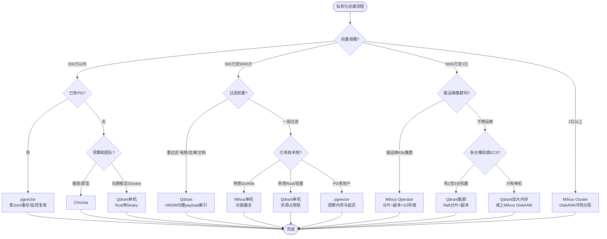
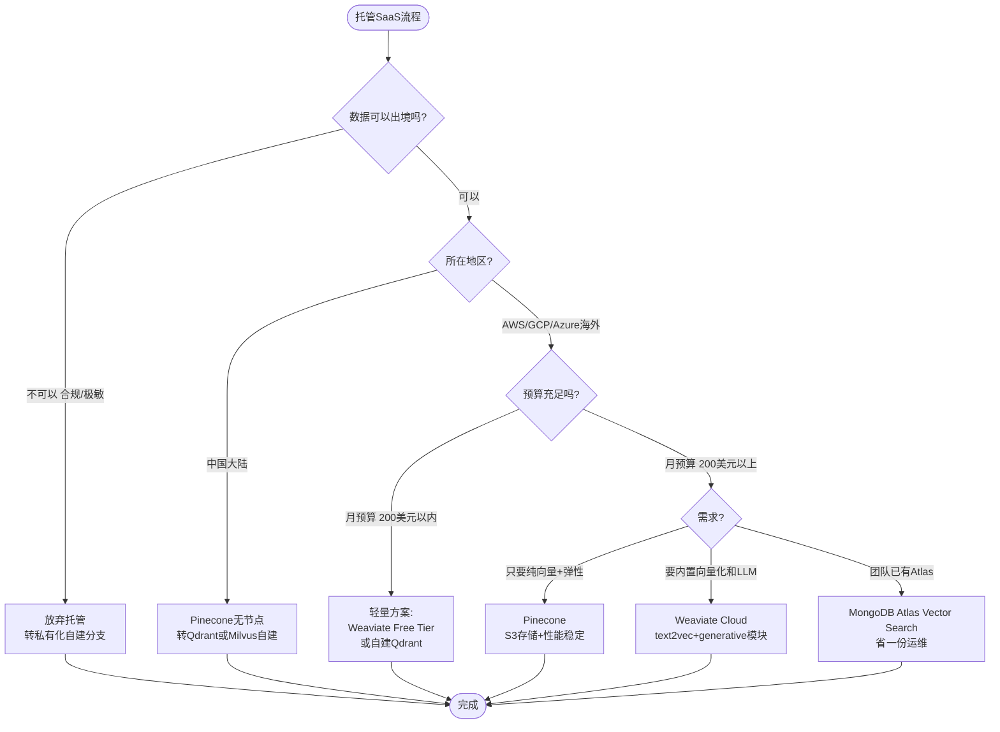

# RAG 向量库如何选型：多维度深度对比

> 向量库是 RAG 系统的"蓄水池"，选型直接决定检索性能、可扩展性和运维成本。面对 FAISS、Milvus、Qdrant、pgvector、Chroma 等十几种选项，如何根据业务场景选对？本文从 10+ 维度系统对比主流向量库，并给出场景化选型建议。

## 一、选型前先想清楚的三个问题

在翻对比表之前，先回答三个问题，它们直接决定选型方向：

```
问题 1: 你的数据量级是多少？
        < 100万向量  →  嵌入式库够用，零运维
        100万~1亿   →  需要独立服务，关注单机性能
        > 1亿       →  必须分布式，关注水平扩展

问题 2: 你的部署环境是什么？
        纯本地/边缘  →  不能依赖云服务，优先本地库
        公有云       →  可以用托管服务（Pinecone、Weaviate Cloud）
        私有云/混合  →  需要私有化部署能力

问题 3: 你需要"过滤检索"吗？
        只做纯语义搜索     →  只需要 ANN 能力
        按时间/标签/分类搜 →  必须支持元数据过滤（Filtered Search）
        还要做关键词搜索   →  需要支持稀疏向量 / BM25 混合检索
```

这三个问题的答案，能把候选范围从 10+ 种缩小到 2~3 种。

## 二、向量库的核心技术维度

### 2.1 ANN 索引算法

向量检索的核心是**近似最近邻（ANN）**。精确最近邻（Flat / KNN）是 O(N) 的，百万级向量就扛不住了，所以生产环境都用近似算法。

| 算法     | 原理                     | 召回率 | 查询速度 | 内存占用 | 构建速度 | 动态增删 |
| -------- | ------------------------ | ------ | -------- | -------- | -------- | -------- |
| **HNSW** | 分层小世界图（多层跳表） | ★★★★★ | ★★★★★ | ★★☆☆☆（高） | ★★★☆☆ | ★★★★★ |
| **IVF**  | 倒排文件（聚类分桶）     | ★★★☆☆ | ★★★★☆ | ★★★★☆（低） | ★★★★★ | ★★★☆☆ |
| **IVF-PQ** | IVF + 乘积量化压缩    | ★★☆☆☆ | ★★★★★ | ★★★★★（极低） | ★★★★☆ | ★★☆☆☆ |
| **DiskANN** | 磁盘友好的图索引     | ★★★★☆ | ★★★☆☆ | ★★★★★ | ★★☆☆☆ | ★★★☆☆ |
| **SCaNN** | Google，量化 + 剪枝    | ★★★★☆ | ★★★★★ | ★★★★☆ | ★★★☆☆ | ★★☆☆☆ |

**选型经验：**

- **HNSW 是当前最主流的选择**：召回率高、查询快、支持动态增删，唯一缺点是吃内存（100 万 768 维向量约占 6~8GB 内存）。
- **内存紧张用 IVF-PQ**：能把内存压缩到 1/10~1/30，但召回率下降明显，适合冷数据/海量数据场景。
- **超大规模用 DiskANN**：向量放磁盘，内存只存索引，单机可支撑十亿级向量，但查询延迟高（几十到几百 ms）。

### 2.2 HNSW 的关键参数

大多数向量库默认用 HNSW，调这三个参数直接决定性能：

```
HNSW 有三个核心参数：

  M:          每层每个节点的连接数（默认 16~32）
              ↑ M 越大 → 召回越高、内存越大、构建越慢
              ↓ M 越小 → 速度越快、召回越低

  efConstruction: 构建时搜索邻居的范围（默认 100~500）
              ↑ 越大 → 索引质量越高、构建越慢
              ↓ 越小 → 构建快、索引可能差

  ef(Search): 查询时搜索邻居的范围（运行时可调）
              ↑ 越大 → 召回越高、查询越慢
              ↓ 越小 → 查询快、召回可能低
```

**典型调参：**

| 场景           | M    | efConstruction | ef (Search) |
| -------------- | ---- | -------------- | ----------- |
| 追求极致召回   | 48~64 | 400~800       | 256~512     |
| 平衡（默认）   | 16~32 | 100~200       | 64~128      |
| 追求极致速度   | 8~12 | 50~100        | 16~32       |

> **经验法则**：先把 ef(Search) 调到能接受 Recall@K 的最小值。比如你要 Recall@5 > 0.95，先试 ef=64，不够再加到 128，以此类推。

### 2.3 元数据过滤（Filtered Search）

RAG 很少做纯语义检索，通常要加过滤：

```
"搜 2024 年之后发布的，关于 React 的文档"
       ↑ 时间过滤          ↑ 标签过滤

"只在『产品手册』这个分类里搜密码重置流程"
       ↑ 分类（元数据）过滤
```

**过滤的两种实现策略：**

| 策略         | 做法                        | 优势                 | 劣势                     | 代表       |
| ------------ | --------------------------- | -------------------- | ------------------------ | ---------- |
| **预过滤**   | 先按过滤条件缩小候选集，再 ANN | 精度高，不漏结果     | 过滤后候选太少 → 退化为线性扫描 | Qdrant、Milvus |
| **后过滤**   | 先 ANN 取 top-N，再按条件过滤   | 性能稳定             | 过滤后可能不剩结果 / 召回低 | 早期 FAISS |
| **原生过滤** | 索引中嵌入过滤结构，搜索时同步剪枝 | 兼顾精度和性能 | 实现复杂 | Qdrant（HNSW 内建 payload 索引） |

> **选型关键**：如果你的业务重度依赖过滤（比如电商、法律文书、带时间维度的知识库），Qdrant 的原生过滤是当前体验最好的。

## 三、主流向量库全景对比

我们选最常用的 7 个向量库，从 12 个维度对比。

### 3.1 基础信息总览

| 维度         | FAISS              | Milvus             | Qdrant             | pgvector           | Chroma             | Weaviate           | Pinecone           |
| ------------ | ------------------ | ------------------ | ------------------ | ------------------ | ------------------ | ------------------ | ------------------ |
| **开发方**   | Meta               | Zilliz             | Qdrant (德国)      | pgvector 社区      | Chroma (美国)      | Weaviate (荷兰)    | Pinecone (美国)    |
| **开源协议** | MIT                | Apache 2.0         | Apache 2.0         | PostgreSQL License | Apache 2.0         | BSD-3              | 闭源（SaaS）       |
| **语言实现** | C++ (Python 绑定)  | Go + C++           | Rust               | C (PG 扩展)        | Python + Rust      | Go                 | 未公开             |
| **部署形态** | 嵌入式库           | 独立服务 + 集群    | 独立服务 + 集群    | PG 扩展            | 嵌入式 / 服务端    | 独立服务 + 集群    | 纯托管 SaaS        |

### 3.2 功能维度对比

| 功能                    | FAISS | Milvus | Qdrant | pgvector | Chroma | Weaviate | Pinecone |
| ----------------------- | :---: | :----: | :----: | :------: | :----: | :------: | :------: |
| HNSW 索引               |  ✅   |   ✅   |   ✅   |    ✅    |   ✅   |    ✅    |    ✅    |
| IVF / IVF-PQ            |  ✅   |   ✅   |   ❌   |    ✅    |   ❌   |    ✅    |    ✅    |
| DiskANN                 |  ❌   |   ✅   |   ❌   |    ❌    |   ❌   |    ❌    |    ❌    |
| **元数据过滤**          |  ⚠️   |   ✅   | ✅(原生) |    ✅    |   ✅   |    ✅    |    ✅    |
| 混合检索 (BM25/稀疏)    |  ❌   |   ✅   |   ✅   |    ⚠️   |   ❌   |    ✅    |    ✅    |
| 多向量字段              |  ✅   |   ✅   |   ✅   |    ❌    |   ✅   |    ✅    |    ✅    |
| 动态增删改              |  ⚠️   |   ✅   |   ✅   |    ✅    |   ✅   |    ✅    |    ✅    |
| 持久化                  |  ⚠️   |   ✅   |   ✅   |    ✅    |   ✅   |    ✅    |    ✅    |
| 分布式/集群             |  ❌   |   ✅   |   ✅   |    ❌    |   ❌   |    ✅    |    ✅    |
| GPU 加速                |  ✅   |   ✅   |   ❌   |    ❌    |   ❌   |    ❌    |    ❌    |

> ⚠️ = 有限支持 / 需要额外实现

### 3.3 性能与扩展性

| 维度                    | FAISS  | Milvus  | Qdrant | pgvector | Chroma | Weaviate | Pinecone |
| ----------------------- | :----: | :-----: | :----: | :------: | :----: | :------: | :------: |
| **单机数据量上限**      | 千万级 | 十亿级  | 亿级   | 千万级   | 百万级 | 亿级     | 无限（托管） |
| **单机 QPS (1M 向量)**  | 高     | 很高    | 很高   | 中       | 中     | 中       | 很高（弹性） |
| **P95 查询延迟 (ms)**   | 5~20   | 5~30    | 5~25   | 10~50    | 20~80  | 15~60    | 10~50    |
| **水平扩展**            | ❌      | ✅ (分片+副本) | ✅ (分片) | ❌ | ❌ | ✅ | ✅（托管自动） |
| **内存效率**            | ★★★☆☆ | ★★★★☆ | ★★★★☆ | ★★★☆☆ | ★★☆☆☆ | ★★★☆☆ | 托管无需关心 |
| **冷数据支持 (磁盘)**   |  ❌    | ✅(DiskANN) | ⚠️(mmap) | ✅(PG表空间) | ❌ | ⚠️ | 托管自动 |

### 3.4 运维与生态

| 维度                    | FAISS  | Milvus  | Qdrant | pgvector | Chroma | Weaviate | Pinecone |
| ----------------------- | :----: | :-----: | :----: | :------: | :----: | :------: | :------: |
| **部署难度**            | ★☆☆☆☆ | ★★★★☆ | ★★★☆☆ | ★★☆☆☆ | ★☆☆☆☆ | ★★★★☆ | ★☆☆☆☆（零运维） |
| **监控/可观测性**        |  ❌    | ✅(Prometheus) | ✅(REST) | ✅(PG监控) | ⚠️ | ✅ | ✅(控制台) |
| **数据备份/恢复**        | 手动   | ✅(快照) | ✅(快照) | ✅(PG备份) | ⚠️ | ✅ | ✅（自动） |
| **LangChain 集成**       | ✅      | ✅      | ✅      | ✅       | ✅     | ✅       | ✅       |
| **LlamaIndex 集成**      | ✅      | ✅      | ✅      | ✅       | ✅     | ✅       | ✅       |
| **客户端 SDK 语言**      | Python | 多语言 | 多语言 | 所有SQL语言 | Python | 多语言 | 多语言 |
| **社区活跃度**           | ★★★★★ | ★★★★☆ | ★★★★☆ | ★★★★★ | ★★★☆☆ | ★★★☆☆ | 闭源 |

## 四、逐个解读：每个库的"人设"

### 4.1 FAISS：纯库之王，性能天花板

```
人设: 没有感情的跑分机器
适合: 追求极致性能、有工程能力自己封装的团队
```

**优点：**
- 纯 C++ 实现，性能是所有开源库的**天花板级别**
- 算法最丰富：HNSW、IVF、IVF-PQ、LSH、Flat、GPU 加速全覆盖
- 嵌入式，零运维，想怎么嵌就怎么嵌

**缺点：**
- 没有服务端形态，要自己封装：HTTP 接口、持久化、分布式都得自己写
- 原生不支持元数据过滤，得先过滤 ID 再检索（预过滤实现麻烦）
- 没有动态增量索引（IndexIVF 新增数据需要重建或定期 merge）

**一句话**：如果你有足够的工程能力，FAISS + 自研封装是性能最优解。否则直接用上层服务。

### 4.2 Milvus：分布式扛把子，海量数据首选

```
人设: 企业级重型卡车，拉得多跑得稳
适合: 数据量大（千万+）、要集群、要高可用的生产场景
```

**优点：**
- 分布式最成熟：支持分片、副本、负载均衡，单机不够可以横向扩
- 存储分层：热数据在内存（HNSW）、冷数据在磁盘（DiskANN），成本可控
- 功能最全：BM25 混合检索、标量过滤、多向量、GPU 索引，全都有
- Attu 可视化管理后台，运维体验好

**缺点：**
- **重**：最小部署依赖 etcd + MinIO(S3) + 3 个 Milvus 组件，至少 5 个容器
- 资源消耗大：轻量场景用它是"杀鸡用牛刀"
- 运维复杂度高：调优参数多，需要学习曲线

**一句话**：知识库超过千万向量，或者需要高可用集群 → Milvus 是首选。

### 4.3 Qdrant：后起之秀，过滤检索体验最佳

```
人设: 精心调教的运动轿车，操控感一流
适合: 中大规模数据、重度依赖元数据过滤、混合检索的场景
```

**优点：**
- **元数据过滤体验最好**：HNSW 内建 payload 索引，过滤+向量同步剪枝，性能损失极小
- Rust 实现，内存安全、资源占用比 Milvus 低
- 部署简单：单 binary 或单 Docker 即可运行，最小依赖
- 支持稀疏向量（BM25），混合检索开箱即用
- API 设计优雅，SDK 体验好

**缺点：**
- 分布式能力不如 Milvus 成熟（分片可以，自动再平衡在演进）
- 生态不如 Milvus 丰富（但主流框架都支持了）
- 不支持 GPU 加速

**一句话**：单机/中小规模场景，Qdrant 在"体验/性能/运维成本"三者之间平衡最好。

### 4.4 pgvector：和业务库共存，小而美

```
人设: 全能家用SUV，啥都能装不挑路
适合: 数据量<千万、已有 PG、不想运维额外组件的场景
```

**优点：**
- **零额外运维**：就是 PostgreSQL 一个扩展，直接 `CREATE EXTENSION vector`
- 和业务数据共存：向量 + 关系数据一张表，Join 查询丝滑
- PG 的所有能力直接继承：备份、监控、权限、事务、JSONB 元数据过滤
- 小数据量（<100 万）性能不输专用向量库

**缺点：**
- 单表千万级以上性能开始下降（PG 的 MVCC + 扩展实现的限制）
- 不支持分布式，单机上限明确
- 不支持 GPU、不支持 BM25（要加 paradedb 扩展）
- HNSW 索引构建慢、占用大（比 FAISS/Milvus 慢不少）

**一句话**：PG 用户 + 数据量不大 → pgvector 真香，别折腾别的。

### 4.5 Chroma：原型神器，上手五分钟

```
人设: 轻量级滑板车，说走就走
适合: Demo、原型验证、个人项目、小体量知识库
```

**优点：**
- 嵌入 Python，5 行代码跑起来：
```python
import chromadb
client = chromadb.Client()
col = client.create_collection("test")
col.add(documents=["hello world"], ids=["1"])
col.query(query_texts=["hi"], n_results=1)
```
- 默认做了 embedding 封装，连 embedding 模型都帮你选好
- LangChain/LlamaIndex 默认支持，文档案例多

**缺点：**
- 嵌入式 Python，性能瓶颈明显，百万级以上很吃力
- 服务端形态刚出不久，生产能力未经验证
- 索引算法只有 HNSW，算法丰富度不够
- 内存占用偏高

**一句话**：做 Demo / 验证想法 → 用 Chroma 最快，上生产再换。

### 4.6 Weaviate：全栈 RAG 平台

```
人设: 精装修公寓，拎包入住
适合: 不想搭积木、要"一站式"方案的场景
```

**优点：**
- 不仅是向量库，还内置了：Embedding 模块、Rerank、BM25、LLM 集成、GraphQL 查询
- 自带模块化设计，`text2vec-openai`、`generative-openai` 直接配
- 支持混合型（向量 + 倒排 + 图）检索

**缺点：**
- 性能不如 Milvus/Qdrant 纯粹（功能多自然有取舍）
- Go 写的 HNSW 不如 C++/Rust 版本快
- 概念多、学习曲线陡
- 自定义空间相对小

**一句话**：要快速出一个带向量化的完整 RAG，不想组装多个组件 → 可以试试 Weaviate。

### 4.7 Pinecone：托管鼻祖，纯 SaaS

```
人设: 代驾司机，省心但不能自己改
适合: 不想运维任何基础设施、预算充足的团队
```

**优点：**
- **零运维**：API 直接用，不用管服务器、扩容、备份、监控
- 弹性伸缩：自动水平扩展，从 1 万到 10 亿向量无缝
- 性能稳定：SLA 保证可用性
- 功能齐全：命名空间（隔离租户）、过滤、混合检索都有

**缺点：**
- **贵**：按 pod（计算+存储单元）计费，月费几百到几千刀不等
- 数据安全：向量和元数据都存在第三方，敏感数据要评估合规
- 黑盒：无法看到底层实现，无法调内部参数
- 国内访问延迟和网络稳定性问题

**一句话**：海外业务 + 预算足 + 不想运维 → Pinecone。其他场景请三思。

## 五、决策矩阵：按场景选

### 5.1 按数据量级

```
数据量级 < 100万 向量:
  ├─ 有 PG 实例          → pgvector  ✅ （不新增任何组件）
  ├─ Python 原型/快速验证 → Chroma    ✅ （5分钟跑通）
  └─ 要高性能、自封装     → FAISS     ✅ （性能天花板）

数据量级 100万 ~ 1亿 向量:
  ├─ 重度依赖过滤检索     → Qdrant    ✅ （原生过滤最佳平衡）
  ├─ 有 PG + 不超500万   → pgvector  ✅ （继续用）
  ├─ 要混合检索(BM25)    → Qdrant / Milvus ✅
  └─ 要高可用集群         → Milvus    ✅ （分布式最成熟）

数据量级 > 1亿 向量:
  ├─ 私有部署            → Milvus 集群 ✅ （DiskANN + 冷热分层）
  ├─ 海外公有云           → Pinecone  ✅ （托管省事）
  └─ 混合云              → Weaviate 集群 ✅
```

### 5.2 按部署环境

```
纯本地 / 边缘设备 (笔记本/手机/盒子):
  → FAISS (C++, 轻量) 或 Chroma (嵌入式)
  ✗ 不要选需要独立服务的 Milvus/Qdrant（太重）

公有云 (AWS/阿里云/腾讯云):
  预算充足:    → Pinecone (托管) / Weaviate Cloud
  自己运维:    → Milvus Operator (K8s) / Qdrant Cluster
  数据<千万:   → 云数据库 PG + pgvector 扩展

私有云 / 私有化部署 (金融/政企/医疗):
  → Milvus / Qdrant 二选一
  ✗ Pinecone、Weaviate Cloud 直接排除（公有 SaaS）
  选的标准: 数据超亿级 → Milvus；否则 → Qdrant
```

### 5.3 按业务场景

| 业务场景                     | 推荐方案                        | 理由                                   |
| ---------------------------- | ------------------------------- | -------------------------------------- |
| **企业知识库问答** (10万~百万) | pgvector 或 Qdrant              | 知识更新不频繁，过滤需求中等           |
| **电商商品搜索** (千万级 SKU) | Qdrant / Milvus                 | 重度依赖属性过滤（类目、价格、品牌）   |
| **法律/医疗文档** (百万~千万) | Qdrant                          | 精确过滤 + 合规私有化                  |
| **论文/学术检索** (亿级)      | Milvus (DiskANN)                | 数据量大，冷热分层降本                 |
| **多租户 SaaS RAG**          | Qdrant (集合隔离) / Pinecone (命名空间) | 租户隔离 + 弹性扩展            |
| **对话系统短期记忆** (万级)   | Chroma / pgvector               | 小数据、快速读写                       |
| **图像/视频特征检索** (千万级) | FAISS (GPU) / Milvus (GPU 索引) | 高维向量 + 需要 GPU 加速               |

## 六、实际踩坑经验

### 坑 1：低估内存开销

```
很多人以为 100万 × 768维 × 4字节(float32) = 3GB 内存就够了。
实际上：

  HNSW 索引的额外开销:
    节点连接指针: M(16~32) × 4字节 × 层数(4~6) ≈ 向量本身的 1~2倍
    向量原始数据: 也要存（返回结果时需要）
    元数据: JSON 字段、倒排索引等

  实际内存 ≈ 原始向量大小 × (2.5 ~ 4) 倍

100万 768维向量 → 实际要 7.5GB ~ 12GB 内存。
很多人上线后才发现 OOM，就是没算清楚这笔账。
```

**解决**：
- 预算内存的时候 ×3 打余量
- 内存不够就降维度（bge-small-zh 512 维 vs bge-large-zh 1024 维）
- 或者用 IVF-PQ 压缩

### 坑 2：过滤条件太苛刻，召回骤降

```
场景: "只搜 2024 年 3 月的文档，且分类=财务"

  向量库有 1000 万条数据
  过滤后只剩 2000 条符合条件
  HNSW 在这 2000 条里搜 → 图结构稀疏，连接断了
  结果: 明明有匹配的文档，就是搜不出来
```

**解决**：
- 过滤后候选集太小（<1 万）就切到 Flat 暴力搜
- Qdrant 会自动处理（原生过滤好得多），Milvus 可以调 `search_params` 的 `nprobe`
- 或者先放宽过滤，ANN 取 top-N 之后再做后过滤（牺牲部分召回换性能）

### 坑 3：冷启动 / 增量更新问题

```
HNSW 是一种"增量构建会退化"的索引：
  批量一次性构建 → 图结构质量最高
  每天逐条插入 → 图结构越来越乱，召回下降 5%~15%

症状: 刚上线效果很好，跑了两个月后检索越来越差。
```

**解决**：
- 定期（每周/每月）后台离线重建索引，再热切换
- Milvus 有 `compact` 指令，Qdrant 有自动优化器可以定期触发
- 批量更新优于单条逐条更新（攒 1000 条再 upsert）

### 坑 4：距离度量选错了

```
Embedding 模型输出后，不同模型要求的距离函数不一样：

  模型 normalize 了（向量模长=1）
    → Inner Product (内积) = Cosine Similarity，效果一样快
    → 用 Inner Product 更快（不用算分母）

  模型没 normalize
    → 必须用 Cosine
    → 用 L2 距离会出问题（长向量天然更近）

大部分中文 embedding (bge、m3e) 推荐 normalize 后用 Inner Product。
选 L2 / Cosine 直接选错了 → 检索效果差一个档次。
```

**解决**：
- 看 embedding 模型文档，推荐啥就用啥
- bge 系列：先 `normalize_embeddings=True`，然后用 IP/Cosine
- 不确定就都 normalize + Cosine，效果不会太差

### 坑 5：pgvector 里存了千万向量还在硬扛

```
pgvector 很方便，但它不是银弹。

  500万 768维向量:
    PG 内存够 → HNSW 还能打，p95 延迟 20~50ms  ✅
    PG 内存不够（索引全走磁盘） → p95 延迟飙到 500ms+  ❌

  1000万+ 向量:
    HNSW 索引构建需要几十个 GB 内存 + 几小时
    每次 VACUUM / 索引重建痛不欲生
```

**解决**：
- 500 万以内大胆用 pgvector
- 500~1000 万观察，内存够就继续
- 超 1000 万 → 迁移到 Qdrant 或 Milvus

## 七、最终选型流程图

### 7.1 总流程图：一张图跑完选型

```mermaid
flowchart TD
    A([开始选型]) --> B{部署形态?}

    B -->|纯托管 SaaS| C1{合规和地区?}
    B -->|私有化自建| D1[进入自建流程]
    B -->|嵌入式/本地库| E1{用途?}

    %% ===== 分支 A：托管 SaaS =====
    C1 -->|数据可出境 + 海外节点| C2[Pinecone / Weaviate Cloud]
    C1 -->|极敏感/中国大陆无节点| C3[转自建分支]

    %% ===== 分支 B：私有化自建 =====
    D1 --> D2{数据量级?}
    D2 -->|100万以内| D3{已有PostgreSQL?}
    D2 -->|100万至1亿| D4{过滤需求重吗?}
    D2 -->|1亿以上| D5[Milvus集群\nDiskANN冷热分层]

    D3 -->|有| D3a[pgvector \n不新增任何组件]
    D3 -->|无| D3b{要快速Demo?}
    D3b -->|是| D3b1[Chroma \n5分钟跑通]
    D3b -->|否| D3b2[Qdrant \n单机Docker即用]

    D4 -->|重过滤\n属性/分类/时间| D4a[Qdrant \n原生HNSW+过滤]
    D4 -->|一般| D4b{团队能运维K8s/集群吗?}
    D4b -->|能| D4b1[Milvus/Qdrant集群]
    D4b -->|单机/Docker即可| D4b2[Qdrant单机 \n或pgvector继续扛]

    %% ===== 分支 C：嵌入式/本地 =====
    E1 -->|Demo/原型/小项目| E2[Chroma \nPython内嵌零依赖]
    E1 -->|嵌入业务系统+性能优先| E3{需要GPU加速?}
    E3 -->|需要(图像/多模态)| E3a[FAISS(GPU) \n性能天花板]
    E3 -->|不需要| E3b[FAISS \n自研服务层封装]

    %% 最终收敛
    C2 --> Z([完成选型])
    C3 --> D1
    D3a --> Z
    D3b1 --> Z
    D3b2 --> Z
    D4a --> Z
    D4b1 --> Z
    D4b2 --> Z
    D5 --> Z
    E2 --> Z
    E3a --> Z
    E3b --> Z
```

### 7.2 私有化自建细化流程（80% 场景走这里）



> **📌 特殊需求补充**（任一满足即额外调优）：
> - 需要 **GPU 加速**（图像/多模态）→ FAISS(GPU) 或 Milvus GPU 索引
> - 需要 **BM25 + 向量混合检索** → Qdrant（稀疏向量）或 Milvus（BM25）
> - 多租户 SaaS 隔离 → Qdrant（多集合）或 Pinecone（命名空间）

### 7.3 托管 SaaS 细化流程



> **⚠️ 托管选型注意**：
> - **隐私条款**（GDPR/HIPAA/等保）：务必与供应商确认数据存储地域
> - **实测延迟**：中国大陆访问海外节点，300ms 以上很常见
> - **峰值费用**：按 Pod 计费要压测峰值，避免月底账单爆炸
> - **出口锁定**：Pinecone 无数据导出 API，迁移成本极高

### 7.4 速查手册：30 秒定结论

如果不想走流程图，直接查表：

| 你的场景 | 首选 | 备选 | 别选 |
| --- | --- | --- | --- |
| **PG 用户 + <500 万向量** | pgvector ✅ | Chroma | Milvus（太重） |
| **快速 Demo / 原型验证** | Chroma ✅ | FAISS | Pinecone（贵+慢启动） |
| **100万~5000万 + 过滤多** | Qdrant ✅ | Milvus | pgvector（过滤性能弱） |
| **>1 亿向量 + 冷热分层** | Milvus 集群 ✅ | Qdrant 集群 | pgvector / Chroma |
| **海外业务 + 零运维** | Pinecone ✅ | Weaviate Cloud | 任何自建（人力成本） |
| **图像/多模态 + GPU 加速** | FAISS(GPU) ✅ | Milvus(GPU) | pgvector / Qdrant |
| **政企私有化 + <千万** | Qdrant ✅ | pgvector | Pinecone / Weaviate Cloud |
| **内置向量化 + 不想组装** | Weaviate ✅ | — | FAISS（要全自研） |
| **已有 ES 集群 + 小体量** | ES k-NN ✅ | pgvector | Milvus（重复运维） |

## 八、总结：选型的本质是权衡

向量库选型没有"最好"，只有"最适合"。核心是三个维度的权衡：

```
           性能
            ▲
            │  Milvus(分布式)
            │  FAISS(纯库)
            │
            │        Qdrant
            │
            │  pgvector     Chroma
            │
            └─────────────────────► 运维复杂度
           /
          /
         ▼
      功能丰富度
```

**三条实操建议：**

1. **先简单后复杂**：先用 pgvector/Chroma 跑起来，数据量上来了再迁移。向量库迁移不难（导出 embedding → 导入新库，最多半天工作量）。
2. **过滤多 → 选 Qdrant**：元数据过滤是 RAG 的高频需求，Qdrant 在这块体验最好。
3. **数据超亿 → 选 Milvus**：只有它的冷热分层 + DiskANN 能把成本压下来，分布式也最成熟。

向量库是 RAG 的基础设施，但不是 RAG 质量的瓶颈。**RAG 效果的上限，70% 由切分策略、embedding 模型、重排序决定，30% 由向量库决定。** 别在选型上花太多时间纠结，跑起来再迭代才是正道。
