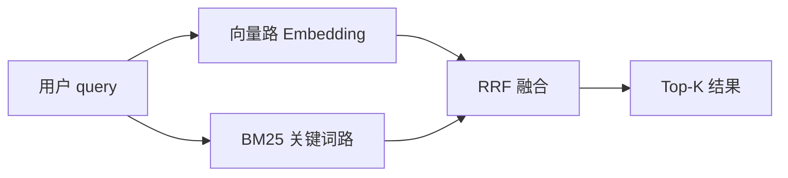
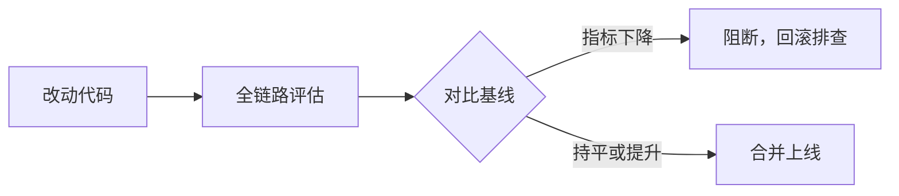

# 如何提高 RAG 性能指标？从召回率、准确率到响应速度的完整优化指南

> RAG 系统上线容易，做好很难。同样一套知识库，切分策略差一点，召回率掉 20%；检索多路融合加一加，准确率提一个档次；缓存和分层策略上齐，响应速度能快 3 倍。本文从「召回率 → 准确率 → 响应速度」三个维度，给出可落地的完整优化指南。

## 一、先看结论：三大核心要点

优化 RAG 性能，先记住三个结论：

**结论 1｜召回率是天花板。** 检索阶段漏掉的文档，生成阶段永远找不回来。先解决「找得到」，再谈「答得对」；数据清洗、合理切分和混合检索是最被低估的优化点。

**结论 2｜准确率靠两层。** 重排序解决检索精准度（找得准），Prompt 约束 + 引用溯源解决生成忠实度（答得对、不编造）。

**结论 3｜速度主战场在 LLM。** 检索环节已接近极限，真正的延迟大头在生成环节；流式输出 + Cheap-First + 缓存，见效最快。

下文先建立统一的度量标准，再对三个结论逐一详解。

## 二、度量先行：没有指标就没有优化

优化 RAG 的第一原则：**没有指标，就没有优化方向**。别凭感觉改，先建立评估基线。

### 2.1 三大指标体系的定义

```mermaid
graph LR
    A[用户提问] --> B[检索 Recall]
    B --> C[生成 Accuracy]
    C --> D[响应 Speed]
    B -.->|Recall@K / Hit Rate / MRR / NDCG| E[度量]
    C -.->|Context Precision / Faithfulness / Answer Relevance| E
    D -.->|P50 / P99 延迟 / QPS / 成本| E
```

| 指标维度 | 回答的问题         | 核心指标                                          | 衡量什么                    |
| -------- | ------------------ | ------------------------------------------------- | --------------------------- |
| 召回率   | 该找的内容找到了吗 | Recall@K, Hit Rate, MRR, NDCG                     | 检索阶段的「漏检」程度      |
| 准确率   | 答案答对了吗       | Context Precision, Faithfulness, Answer Relevance | 检索是否精准 + 生成是否忠实 |
| 响应速度 | 用户等得久吗       | P50/P99 延迟, QPS, Token 成本                     | 全链路的工程性能            |

### 2.2 先建评估基线

优化前先做三件事：

1. **准备评测集**：至少 50~100 条带标准答案的 query（真实用户问题优先，别只用理想化问题）
2. **跑通全链路评估**：Query → 检索 → 生成 → 打分，得到基线分数
3. **记录每个阶段的耗时**：查询分析、检索、重排、生成各占多少毫秒

有了基线，之后每做一次改动都能量化对比，避免「感觉变好了」的错觉。

## 三、详解结论 1：提升召回率（Recall）

召回率是 RAG 的天花板。检索阶段漏掉的文档，生成阶段永远找不回来。所以优化 RAG 的第一步永远是提高 Recall。

本章三个小结论：

**小结论 1｜切分是地基。** 脏数据和不合理切分是召回率低的第一元凶；数据清洗 + 类型化切分 + Parent-Child 是性价比最高的一步。

**小结论 2｜多路互补是核心。** 向量 + BM25 双路检索 + RRF 融合，覆盖语义与精确两种匹配，是召回率提升投入产出比最高的一招，优先落地。

**小结论 3｜查询侧因需施策。** Query Rewrite 收益最稳定；Multi-Query/HyDE 有额外延迟成本，只在低置信度或高价值 query 时启用；图谱检索仅针对关系型/多跳问题。

下面逐一展开。

### 3.1 数据清洗与合理切分（性价比最高）

脏数据和糟糕的切分是召回率低的第一大元凶。

| 问题         | 表现                         | 对策                                                   |
| ------------ | ---------------------------- | ------------------------------------------------------ |
| 文本含噪声   | 控制字符、乱码、重复段落     | Unicode 归一化（NFC）+ 控制字符清理 + 去重             |
| 一刀切分块   | 语义被切断，检索不到完整信息 | 按文档类型选切分器：Markdown 按标题、表格/代码整体保留 |
| 小块无上下文 | 命中但内容太碎，无法回答问题 | Parent-Child：小块检索、大块喂 LLM                     |

**Parent-Child 检索**是召回率提升的关键一招：

```
文档
 │
 ├── parent-1 [大块 ~2000 字符，上下文完整，不进索引]
 │     ├── child-1a [小块 ~400 字符，可检索]
 │     └── child-1b [小块 ~400 字符，可检索]
 │
检索命中 child-1b ──► 回表取 parent-1 ──► 完整上下文喂给 LLM
```

小块提升命中精度，大块保证上下文完整，两者兼顾。

### 3.2 混合检索 + RRF 融合

单一检索方式各有盲区：

- **向量检索**（Embedding）：懂语义，但精确关键词（型号、人名、编号）弱
- **BM25 关键词检索**：精确匹配强，但不懂语义

双路并行 + RRF（Reciprocal Rank Fusion）融合：



```
score(d) = Σ 1 / (k + rank_source(d))    # k 通常取 60
```

RRF 只看各来源的相对排名，与分数量纲无关，融合异构检索源最简单有效。**这是召回率提升投入产出比最高的一项。**

### 3.3 查询智能：让 query 更会问

用户提问往往口语化、模糊、缺上下文，直接用原始 query 检索效果差。三招提升召回：

| 技术          | 适用场景           | 原理                                            | 代价                     |
| ------------- | ------------------ | ----------------------------------------------- | ------------------------ |
| Query Rewrite | 口语化、含糊 query | 改写为清晰、自包含的检索语句                    | 1 次 LLM 调用            |
| Multi-Query   | 宽泛问题           | 扩展成多个角度变体，分别检索后合并去重          | K 次检索 + 1 次 LLM 调用 |
| HyDE          | 概念型、抽象问题   | 先让 LLM 生成假设答案，用「假答案」的向量去检索 | 1 次 LLM 调用 + 1 次检索 |

> **经验**：Rewrite 是对大多数场景收益最稳定的一个。Multi-Query 和 HyDE 有额外延迟和成本，建议只对低置信度或高价值 query 启用（见「查询路由」）。

### 3.4 查询路由：把合适的 query 分给合适的策略

不是所有问题都要走最重的链路。查询路由按意图和置信度分流：

```
用户 query
  │
  ▼
分析（规则优先，零成本）
  ├── 高置信度 ──► 直接检索（快）
  └── 低置信度 ──► LLM 分析
        ├── 需要改写 ──► Rewrite/Multi-Query/HyDE
        └── 关系型/多跳 ──► 图谱检索
```

### 3.5 图谱检索（进阶）

关系型、多跳型问题（「A 项目的负责人负责过哪些项目？」）是向量检索的盲区。进阶方案：

- **实体图谱**：索引阶段抽实体建图，检索时实体链接 + n-hop 遍历
- **社区摘要**（GraphRAG）：对知识库做社区检测，回答全局性问题
- **Text2Cypher**：自然语言转图查询语句，精确获取结构化关系

> 图谱检索复杂度高，建议先确认业务确实存在大量关系型问题再引入，别为了炫技而加。

## 四、详解结论 2：提升准确率（Accuracy）

召回上来了，不代表答案就对。准确率包含两层：**检索的精准度**（Context Precision）和**生成的忠实度**（Faithfulness）。分别对应结论 2 的「找得准」和「答得对」。

本章三个小结论：

**小结论 1｜先精排，再约束。** 重排序（粗排 Top-50 → 精排 Top-5~10）解决「找得准」；Prompt「仅基于证据回答」+ 引用溯源解决「答得对」。两步缺一不可。

**小结论 2｜重排从免费方案起步。** 先上词面重叠重排（零成本），效果不够再上交叉编码器（性价比高），最后才考虑 LLM 重排。

**小结论 3｜幻觉要靠兜底堵漏。** 上下文裁剪、引用校验、置信度阈值三道兜底，防止 LLM 硬答。

下面逐一展开。

### 4.1 重排序：从「找得到」到「排得对」

向量检索是粗排（双塔，query 和 doc 独立编码，快但不够准）。重排序是精排（Cross-Encoder，query 和 doc 联合编码，准但慢）。

标准做法：**粗排 Top-50 → 精排 Top-5~10**。


两级重排的实现选择：

| 方案           | 原理                      | 优点                | 缺点         |
| -------------- | ------------------------- | ------------------- | ------------ |
| Lexical 重排   | 词面重叠度 + 检索分加权   | 零 LLM 成本，毫秒级 | 不懂语义     |
| 交叉编码器重排 | BGE-Reranker 等小模型精排 | 效果好，成本适中    | 需要额外部署 |
| LLM 重排       | LLM 对候选编号排序        | 效果最好            | 慢 + 贵      |

**优先级建议**：先上词面重叠（免费），再上交叉编码器（性价比高），最后才考虑 LLM 重排。

### 4.2 Prompt 约束与上下文构造

检索到的上下文「有没有用」，很大程度取决于怎么喂给 LLM。

```
你是一个严谨的问答助手。请仅基于以下证据回答问题。
证据不足时需说明，回答中用 [n] 标注引用来源。

【证据】
[Evidence: ev_1] 来源：产品手册.pdf / 第3页
  内容：密码重置流程...

[Evidence: ev_2] 来源：FAQ.md / 密码相关
  内容：如未收到重置邮件...
```

关键约束：

1. **「仅基于证据回答」**——直接抑制幻觉（提升 Faithfulness）
2. **「证据不足需说明」**——避免强行编造
3. **引用溯源 `[n]`**——答案可核查，也方便用户验证

### 4.3 抑制幻觉的兜底手段

即使 Prompt 约束了，LLM 仍可能编造。兜底方案：

- **上下文裁剪**：只保留高相关 chunk，降低无关信息干扰（Top-10 → Top-5，准确率往往不降反升）
- **引用校验**：要求模型输出的每句话都带引用编号，后置校验「引用的编号是否真实存在于上下文中」
- **置信度阈值**：检索相似度低于阈值时，明确告知「知识库中未找到相关信息」，而不是硬答

## 五、详解结论 3：提升响应速度（Speed）

结论 3 说速度主战场在 LLM 生成环节，下面用延迟拆解来证明，并给出具体提速手段。

本章三个小结论：

**小结论 1｜先拆解，再优化。** 延迟大头在 LLM 生成（占总延迟 60%+），不在检索。不拆解就优化等于闭眼开枪。

**小结论 2｜检索优化到点即止。** ANN 索引、并行检索、查询缓存做到位即可，别再压榨检索环节。

**小结论 3｜主攻生成环节。** 流式输出 + Cheap-First + 模型分级见效最快；规则优先、LLM 兜底同时是成本优化。

下面逐一展开。

### 5.1 先拆解延迟，再优化

不拆解就优化，等于闭眼开枪。RAG 端到端延迟分布：

| 阶段       | 典型耗时  | 是否可优化空间            |
| ---------- | --------- | ------------------------- |
| 查询分析   | 50~500ms  | 大（规则优先）            |
| 向量检索   | 20~100ms  | 小（已近极限）            |
| 关键词检索 | 20~100ms  | 小                        |
| 重排序     | 100~500ms | 中（两级重排）            |
| LLM 生成   | 1~5s      | **最大（占总延迟 60%+）** |

**结论：优化响应速度，主战场在 LLM 生成环节，而非检索环节。**

### 5.2 检索环节提速

- **ANN 索引**：用 HNSW 等近似最近邻索引，牺牲可忽略的精度换 10 倍以上速度
- **并行检索**：向量路和关键词路并行发请求，取二者最大耗时而非相加
- **预计算**：embedding 索引时算好，查询时零成本
- **查询缓存**：相同/相似 query 直接命中缓存，秒回

### 5.3 LLM 生成环节提速（主战场）

| 手段           | 原理                                           | 收益             |
| -------------- | ---------------------------------------------- | ---------------- |
| 流式输出       | 首 token 即返回，用户感知延迟骤降              | 体感提升巨大     |
| 上下文压缩     | 裁掉低相关 chunk，减少输入 token               | 减少 TTFT 和成本 |
| 模型分级       | 简单问题用快而便宜的小模型，复杂问题才用大模型 | 显著降低平均延迟 |
| 并行独立子任务 | 多路检索 / 多路 LLM 子任务并行                 | 合并等待时间     |

### 5.4 Cheap-First：规则优先，LLM 兜底

RAG 链路里很多环节其实不需要 LLM：

```
规则匹配（0ms）── 高置信度 ──► 直接出结果
     │
  低置信度
     ▼
LLM 分析（~500ms）──► 成功出结果
     │
  失败
     ▼
回退规则结果（0ms）
```

在意图分析、查询改写、重排序、评估打分等环节都适用。**能用规则解决的不用 LLM，能用确定性方法解决的不用外部调用。** 这不仅是成本优化，更是速度优化。

### 5.5 兜底与降级

高可用是速度的隐形指标。外部依赖（向量库、LLM API）故障时逐级降级，不中断主链路：

- 关键词路故障 → 降级为纯向量检索
- 重排序故障 → 跳过重排，按融合分返回
- LLM 调用失败 → 回退规则结果

## 六、评估闭环：让优化可迭代

### 6.1 回归测试机制

每做一次改动就全量重跑评估，指标低于基线 ×(1-tolerance) 视为回归，阻断合并：



### 6.2 常见指标波动归因

| 现象                 | 常见根因                                       |
| -------------------- | ---------------------------------------------- |
| Recall 高但准确率低  | 召回太泛，无关结果多 → 加强重排、收紧 Top-K    |
| 准确率高但 Recall 低 | 切分太碎/检索太严 → 检查切分、加混合检索       |
| 延迟突然升高         | 新增 LLM 环节/检索未并行 → 检查链路改动        |
| 成本飙升             | Multi-Query/HyDE 滥用 → 用查询路由限制触发条件 |

## 七、优化路线图：按性价比排序

```
Phase 1 基础（投入小、效果大）
  数据清洗 → 合理切分 → Parent-Child → Prompt 约束
Phase 2 检索增强（投入小、效果中）
  混合检索 + RRF → 重排序 → 查询改写
Phase 3 查询智能（投入中、效果中）
  查询路由 → Multi-Query → HyDE
Phase 4 系统性能（持续）
  Cheap-First → 缓存 → 并行 → 流式输出
Phase 5 评估闭环（贯穿始终）
  基线 → 回归测试 → 可观测性
```

## 八、总结

回到开头的三个结论：

1. **召回率是天花板**——详见第三章，先做切分和混合检索
2. **准确率靠两层**——详见第四章，重排序 + Prompt 约束
3. **速度主战场在 LLM**——详见第五章，流式输出 + Cheap-First + 缓存

所有优化都建立在度量之上：**先建评估基线，再动手优化。** 没有指标驱动，一切优化都是盲人摸象。

---

> **相关文章**
>
> - [RAG 性能指标与优化实践](ai/rag-performance.md 'RAG 性能指标与优化实践')
> - [RAG 检索增强生成：从原理到工程实践](ai/rag.md 'RAG 检索增强生成')
> - [BM25 检索算法详解：从原理到零依赖实现](ai/bm25.md 'BM25 检索算法详解')
> - [RAG 向量库选型多维度对比](ai/vector-db-selection.md 'RAG 向量库选型多维度对比')
